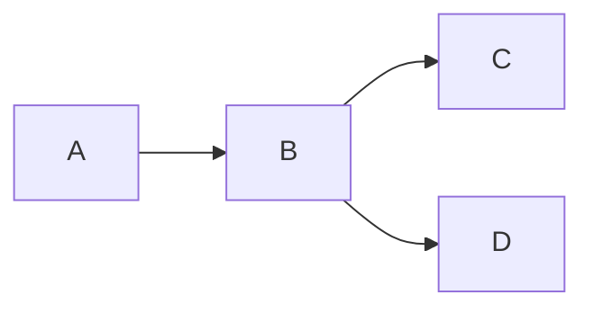

# Sample PyProd Rule to convert Markdown to PDF

This is a sample PyProd rule to convert Markdown to PDF.

## Code highlighting

```python
print("Hello, World!")
```

## MathJax

$$
x_n=x_{n-1}-\frac{f(x_{n-1})}{f'(x_{n-1})}
$$

## Mermaid


