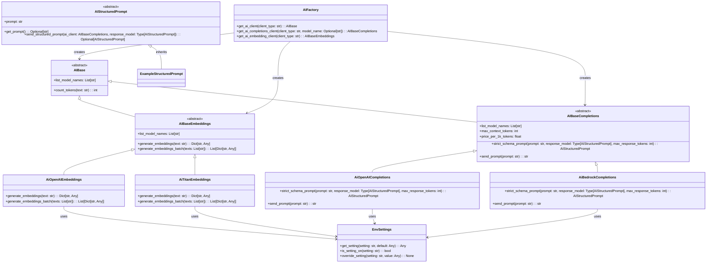

# ai_api_unified · Unified Foundation-Model Client Library

> **Version:** 0.1.0 &nbsp;|&nbsp; **License:** MIT

`ai_api_unified` provides a single, typed interface for calling both completion-style
LLMs and text-embedding models across vendors (OpenAI, Amazon Bedrock/Titan, …).

## Prerequisites

- **Python 3.12.1** (only)  
  We strongly recommend using [pyenv](https://github.com/pyenv/pyenv) to install and pin **exactly** 3.12.1, so that compiled wheels (e.g. `tiktoken`) are available and no Rust toolchain is required.

## Structure



## Installation

```bash
# from your internal Artifactory PyPI
pip install --index-url https://<org>.jfrog.io/artifactory/api/pypi/pypi-local/simple ai_api_unified
```

## Quick start

### Set up environment with your API keys

### Example

```python
"""
Creates a foundation model API client with a single call.
Can swap models with a config or param change.

Create a structured output subclass with your required structure,
and then use it with a single call.
"""
from ai_api_unified import AIFactory, AIStructuredPrompt

# Simple Completions
client = AIFactory.get_ai_completions_client()           # auto-selects engine via .env
response = client.send_prompt("Say hello in German")
print(response)  # → "Hallo!"

# Structured Prompts
class YourStructuredPrompt(AIStructuredPrompt):
    message_input_field: str  # this is an input field, not a result

    message_output_field: Optional[str] = None # This is a parsed output field


    @staticmethod
    def get_prompt(
        message_input: str,
    ) -> str:
        prompt = textwrap.dedent(
            f"""
            Reply with than uppercase version of the message_input in the test_output field.
            message_input: '{message_input_field}'
            """
        ).strip()
        return prompt

    @classmethod
    def model_json_schema(cls) -> Dict[str, Any]:
        """
        JSON schema for the LLM’s *output* only.
        """
        # start with a fresh copy of the base schema (deep-copied there)
        schema: Dict[str, Any] = deepcopy(super().model_json_schema())
        schema["properties"]["message_output_field"] = {"type": "string"}
        # make test_output required for the LLM response
        schema.setdefault("required", [])
        schema["required"].append("message_output_field")
        return schema


  structured_prompt: YourStructuredPrompt = YourStructuredPrompt(message_input_field="hello")
  structured_prompt_result: YourStructuredPrompt = (
      structured_prompt.send_structured_prompt(
          client, ExampleStructuredPrompt
      )
  )
  print(structured_prompt_result.message_output_field) # -> "HELLO"

# Embeddings client use
embedder: AIBaseEmbeddings = AIFactory.get_ai_embedding_client()
dict_embeddings: Dict[str, Any] = embedder.generate_embeddings("vectorize me")
# dict_embeddings holds {"embedding": [], "text": "vectorize me", "dimensions": int}
```

---

## Repository layout

```
src/ai_api_unified/          ← package source
└── ai_base.py           ← abstract interfaces
└── ai_factory.py        ← runtime factory
tests/                   ← pytest suite
.env_template            ← sample environment config
```

---

## Development

```bash
# create virtualenv & install runtime + dev dependencies
poetry install --with dev
pytest -q
```

## Roadmap

- Add simple method for a developer to cycle through models to test them
- Add more provider back-ends (Anthropic, Google).
- Provide async variants for high-throughput workloads.
