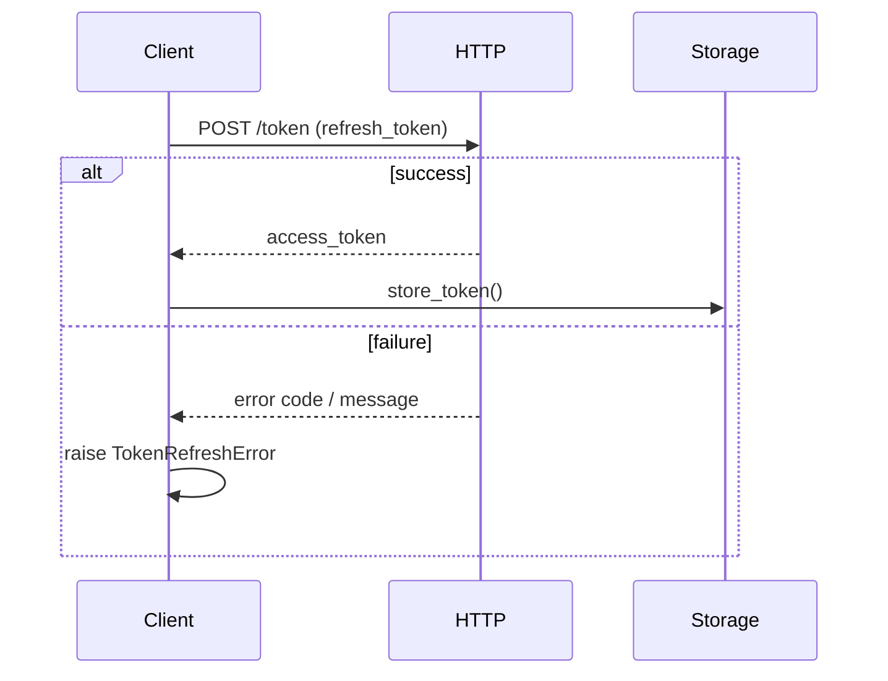

# apiconfig.auth.token

Helpers for OAuth2 token refresh and storage in **apiconfig**. The module handles refresh logic and exposes a minimal storage interface.

## Navigation

**Parent Module:** [apiconfig.auth](../README.md)

**Subpackages:** None

## Contents

- `refresh.py` – functions to retrieve new OAuth2 access tokens.
- `storage.py` – `TokenStorage` interface and `InMemoryTokenStorage` implementation.
- `__init__.py` – exports `refresh_oauth2_token` and storage classes.

## Usage Example

```python
from apiconfig.auth.token import refresh_oauth2_token, InMemoryTokenStorage
import httpx

# HTTP client used by the refresh function
client = httpx.Client(timeout=5.0)

# Fetch a new access token using a refresh token
new_tokens = refresh_oauth2_token(
    refresh_token="abc123",
    token_url="https://auth.example.com/token",
    client_id="my-client",
    client_secret="s3cret",
    http_client=client,
)

storage = InMemoryTokenStorage()
storage.store_token("default", new_tokens)
```

## Key Classes and Functions

| Name | Description |
| ---- | ----------- |
| `TokenStorage` | Abstract base class defining `store_token`, `retrieve_token` and `delete_token`. |
| `InMemoryTokenStorage` | Simple implementation storing tokens in an internal dictionary, useful for testing. |
| `refresh_oauth2_token` | Performs the token refresh operation, handling timeout, HTTP errors, JSON decoding and retry logic. |

### Design Pattern

`TokenStorage` follows the **Strategy** pattern so different storage mechanisms can be used interchangeably.

## Sequence Diagram



## Testing Instructions

### Test Structure
- `tests/unit/auth/token`

### Test Dependencies
- `pytest`
- `httpx`

### Running Tests

Install the packages and run the unit tests for this module:

```bash
python -m pip install -e .
python -m pip install pytest pytest-xdist
pytest tests/unit/auth/token -q
```

## Status

**Stability:** Stable
**API Version:** 0.3.1
**Deprecations:** None

### Maintenance Notes
- Actively maintained with bug fixes and periodic compatibility updates.

### Changelog
- Token management changes are recorded in the main changelog.

### Future Considerations

- Support for additional storage backends, such as Redis or SQL databases.
- CLI utilities to manage tokens outside of application code.
- Enhanced logging and error reporting during token refresh.
