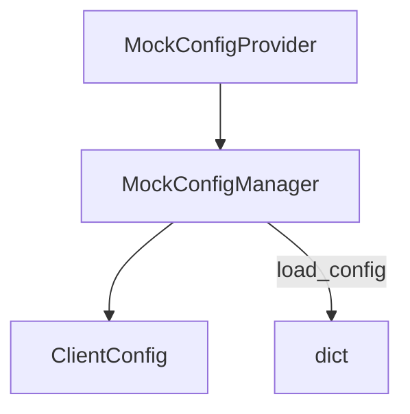

# apiconfig.testing.unit

Helpers for writing unit tests against **apiconfig**. The package provides
assertions, factory functions and mock objects so tests remain concise and free
of external dependencies.

## Navigation

- **Parent:** [../README.md](../README.md)
- **Submodules:**
  - [mocks/README.md](mocks/README.md) – mock implementations for authentication
    strategies and config providers.

## Contents
- `assertions.py` – convenience assertions such as `assert_client_config_valid`.
- `factories.py` – factory helpers for creating valid or invalid `ClientConfig` instances.
- `helpers.py` – misc utilities including context managers for temp files and env vars.
- `mocks/` – lightweight mock implementations of auth strategies and config providers.
- `__init__.py` – re-exports the most common helpers.

## Example
```python
from apiconfig.testing.unit import (
    create_valid_client_config,
    MockConfigProvider,
    MockConfigManager,
)

provider = MockConfigProvider({"hostname": "api.test"})
manager = MockConfigManager([provider])
config = manager.load_config()
assert config.hostname == "api.test"
```

## Key helpers
| Helper | Description |
| ------ | ----------- |
| `create_valid_client_config` | Returns a ready-to-use `ClientConfig` for tests. |
| `MockConfigProvider` / `MockConfigManager` | Duck-typed providers and manager with a `load_config_mock` `MagicMock`. |
| `assert_client_config_valid` | Asserts that a config object has sensible values. |

### Design
Mocks and helpers follow minimal design to keep test code straightforward. They
mirror the real classes closely so they can be swapped in without altering
production code.



## Running tests
Install dependencies and execute the unit tests for this package:
```bash
python -m pip install -e .
python -m pip install pytest pytest-xdist
pytest tests/unit/testing/unit -q
```

## See Also
- [integration](../integration/README.md) – end-to-end helpers.

## Status

**Stability:** Internal
**API Version:** 0.3.1
**Deprecations:** None

### Maintenance Notes
These helpers evolve in tandem with the unit tests. New utilities are added when
test coverage requires them while keeping backwards compatibility whenever
possible.

### Changelog
- Test helper updates are captured in the main changelog.

### Future Considerations
- Extend mocks for additional authentication strategies
- Add async-aware helpers to cover upcoming async clients
