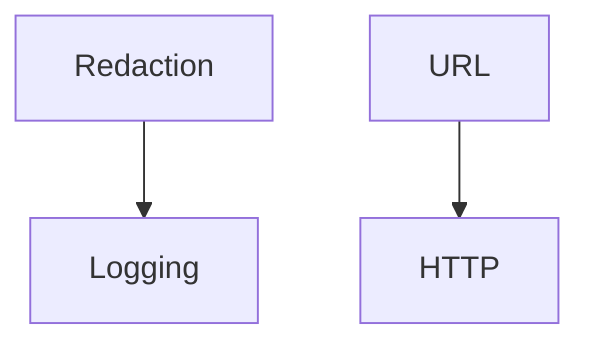

# apiconfig.utils

Miscellaneous utilities shipped with **apiconfig**. They cover HTTP helpers,
URL construction, redaction of sensitive data and logging setup. Each subpackage
can be used independently by API clients.

## Navigation

**Parent Module:** [apiconfig](../README.md)

**Submodules:**
- [logging](./logging/README.md) - configure redacted log output
- [redaction](./redaction/README.md) - scrub secrets from requests and logs
- [url](./url.py) - build and normalise URLs safely

## Contents
- `http.py` – simple helpers for working with HTTP status codes and JSON payloads.
- `url.py` – safe wrappers around `urllib.parse` for building URLs.
- `redaction/` – functions for scrubbing secrets from bodies and headers.
- `logging/` – custom formatters and setup helpers for the library's logging.
- `__init__.py` – exposes the modules above for convenience.

## Example
```python
from apiconfig.utils import http, url

if http.is_success(200):
    full_url = url.build_url("https://api.example.com", "/ping")
    print(full_url)
```

## Key modules
| Module | Purpose |
| ------ | ------- |
| `http` | HTTP status helpers and safe JSON encode/decode with custom exceptions. |
| `url` | Build URLs and normalise query parameters with type safety. |
| `redaction` | Remove sensitive data before logging or output. |
| `logging` | Formatters, handlers and setup utilities for clean log output. |

### Design
Utility modules are kept lightweight and independent. Logging utilities compose
the redaction helpers to avoid code duplication.



## Dependencies

### External Dependencies
- `typing` – runtime type hints and conditional imports
- `urllib.parse` – safe URL parsing and construction
- `logging` – configure loggers and handlers

### Internal Dependencies
- `apiconfig.utils.redaction` – shared helpers for scrubbing secrets
- `apiconfig.types` – common type aliases used in URL helpers

### Optional Dependencies
- `httpx` – used in certain helpers for async HTTP utilities

## Tests
Run the unit tests for utility modules:
```bash
python -m pip install -e .
python -m pip install pytest pytest-xdist
pytest tests/unit/utils -q
```

## Status
Stable – used throughout the project.

### Maintenance Notes
- Stable utilities with occasional updates for new helper functions.

### Changelog
- See project changelog for utility updates and bug fixes.

### Future Considerations
- Add async-friendly helpers and improve formatter integration.
