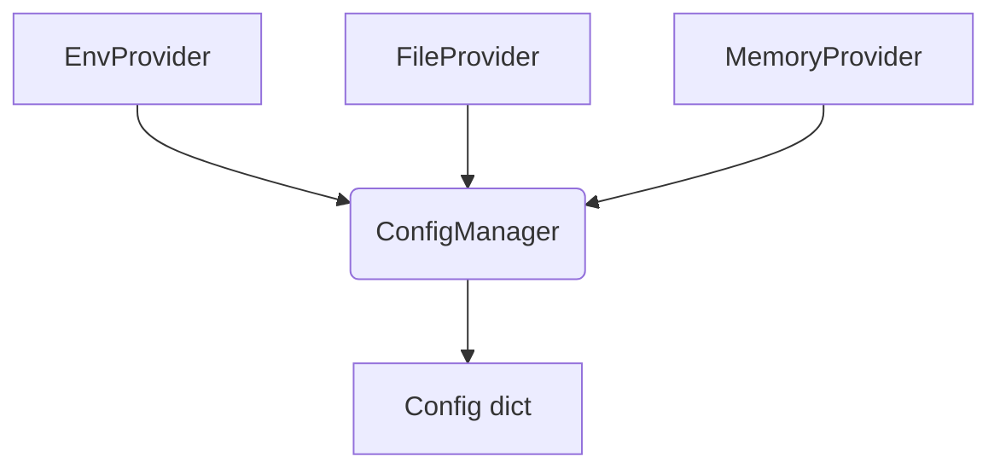

# apiconfig.config.providers

Configuration providers for **apiconfig**. These helpers supply configuration values from
different sources so they can be combined by `ConfigManager`.

## Navigation

**Parent Module:** [apiconfig.config](../README.md)

**Submodules:** None

## Contents
- `env.py` – load configuration from environment variables with optional type inference.
- `file.py` – read configuration from JSON files.
- `memory.py` – in-memory provider useful for tests or defaults.
- `__init__.py` – exports the provider classes.

## Usage
```python
from apiconfig.config.providers import EnvProvider, FileProvider, MemoryProvider
from apiconfig.config.manager import ConfigManager

providers = [
    EnvProvider(prefix="MYAPP_"),
    FileProvider("config.json"),
    MemoryProvider({"timeout": 10})
]

manager = ConfigManager(providers)
config = manager.load_config()
print(config["timeout"])
```

## Key Classes
| Class | Description |
| ----- | ----------- |
| `EnvProvider` | Loads variables with a prefix (default `APICONFIG_`) and coerces simple types when possible. |
| `FileProvider` | Reads JSON files and allows retrieval of values with dot notation and type conversion. |
| `MemoryProvider` | Stores configuration in an internal dictionary. |

### Design
Providers follow a simple strategy-like pattern: each exposes a `load()` method returning
a dictionary which `ConfigManager` merges in order. Later providers override earlier ones.



## Testing
Install requirements and run the unit tests for this package:
```bash
python -m pip install -e .
python -m pip install pytest
pytest tests/unit/config/providers -q
```

## Status
Stable – used internally by other modules in the package.

### Maintenance Notes
- Stable provider API with incremental enhancements as new sources are added.

### Changelog
- Refer to project changelog for provider additions and fixes.

### Future Considerations
- Explore pluggable provider registration for custom environments.
