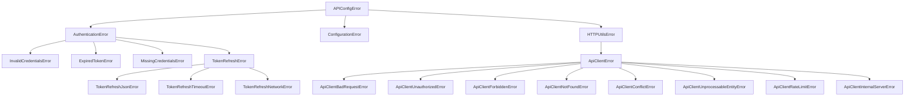

# apiconfig.exceptions

`apiconfig.exceptions` contains the exception hierarchy used throughout the
**apiconfig** project. All exceptions derive from `APIConfigError`, and the
modules are grouped by domain: authentication, configuration and HTTP utilities.
Importing from `apiconfig.exceptions` gives quick access to the most commonly
used classes without reaching into each submodule.

## Navigation
- [Back to parent module](../README.md)
- **Modules**
  - `base.py` – Core base classes and mixins.
  - `auth.py` – Authentication-related errors.
  - `config.py` – Configuration loading and validation errors.
  - `http.py` – HTTP and API client errors.

## Contents
- `base.py` – core base classes and mixins.
- `auth.py` – authentication related errors, including token refresh failures.
- `config.py` – configuration loading and validation errors.
- `http.py` – HTTP and API client errors, JSON encode/decode helpers.
- `__init__.py` – re-exports all exceptions for convenience.

## Example usage
```python
from apiconfig.exceptions import (
    InvalidCredentialsError,
    create_api_client_error,
)

# Raised when login credentials fail validation
raise InvalidCredentialsError("Bad username/password")

# Convert an HTTP status code to the correct error subclass
err = create_api_client_error(404)
print(type(err))  # <class 'apiconfig.exceptions.http.ApiClientNotFoundError'>
```

## Key classes
| Class | Description |
| ----- | ----------- |
| `APIConfigError` | Base class for all apiconfig errors. |
| `AuthenticationError` | Base for authentication failures and token refresh issues. |
| `ConfigurationError` | Base for configuration loading errors. |
| `HTTPUtilsError` | Base for errors raised by HTTP helpers. |
| `ApiClientError` | Base for HTTP API client errors with request/response context. |

### Design
The exceptions follow a simple inheritance tree allowing you to catch broad
categories or specific errors as needed.



## Testing
Install dependencies and run the unit tests for this package:
```bash
python -m pip install -e .
python -m pip install pytest
pytest tests/unit/exceptions -q
```

## See Also
- [auth](../auth/README.md) – strategies that raise authentication errors
- [config](../config/README.md) – configuration providers that emit errors

## Status
Stable – exceptions are widely used across the library and covered by unit
tests.

### Maintenance Notes
- Exception hierarchy is stable; new exceptions added as needed.

### Changelog
- Major changes are noted in the project changelog.

### Future Considerations
- Possible expansion for async error handling.

