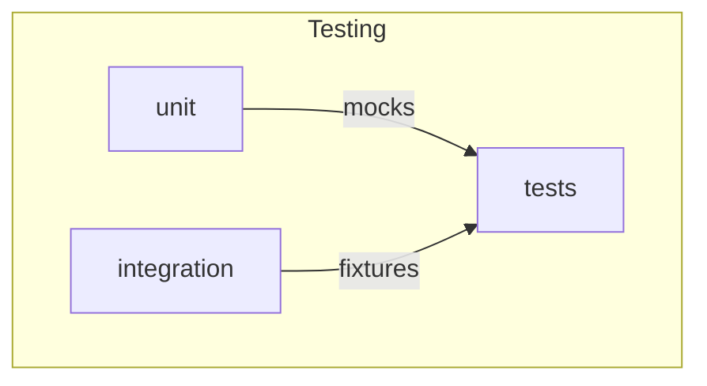

# apiconfig.testing

Testing utilities bundled with **apiconfig**. This package organises helpers for
both unit and integration tests so developers can verify clients without writing
boilerplate code.

## Navigation

**Parent:** [apiconfig](../README.md)

**Submodules:**
- [unit](./unit/README.md) – unit-test helpers.
- [integration](./integration/README.md) – integration-test helpers.

## Contents
- `unit/` – assertions, factories and mocks for isolated unit tests.
- `integration/` – fixtures and HTTP server helpers for end‑to‑end scenarios.
- `auth_verification.py` – common checks for authentication headers during tests.
- `__init__.py` – exposes the most useful helpers across subpackages.

## Example
```python
from apiconfig.testing.integration import configure_mock_response
from apiconfig.testing.unit import create_valid_client_config

config = create_valid_client_config(hostname="api.test")
configure_mock_response(httpserver, path="/ping", response_data={"ok": True})
```

## Key modules
| Module | Purpose |
| ------ | ------- |
| `unit` | Mocks and assertions for fast unit tests. |
| `integration` | Spin up mock HTTP servers and provide fixtures for real‑world flows. |
| `auth_verification` | Advanced helpers for verifying auth behaviour in tests. |

### Diagram


## Running tests
Install dependencies and run all project tests:
```bash
python -m pip install -e .
python -m pip install pytest pytest-httpserver pytest-xdist
pytest -q
```

## Status
Internal – APIs may evolve alongside the test suite.

### Maintenance Notes
- Test utilities are maintained with the suite and may change frequently.

### Changelog
- No separate changelog; refer to repository history for changes.

### Future Considerations
- Additional helpers will be introduced as new features require.

## See Also
- [unit](./unit/README.md) – unit-test helpers
- [integration](./integration/README.md) – integration test utilities
