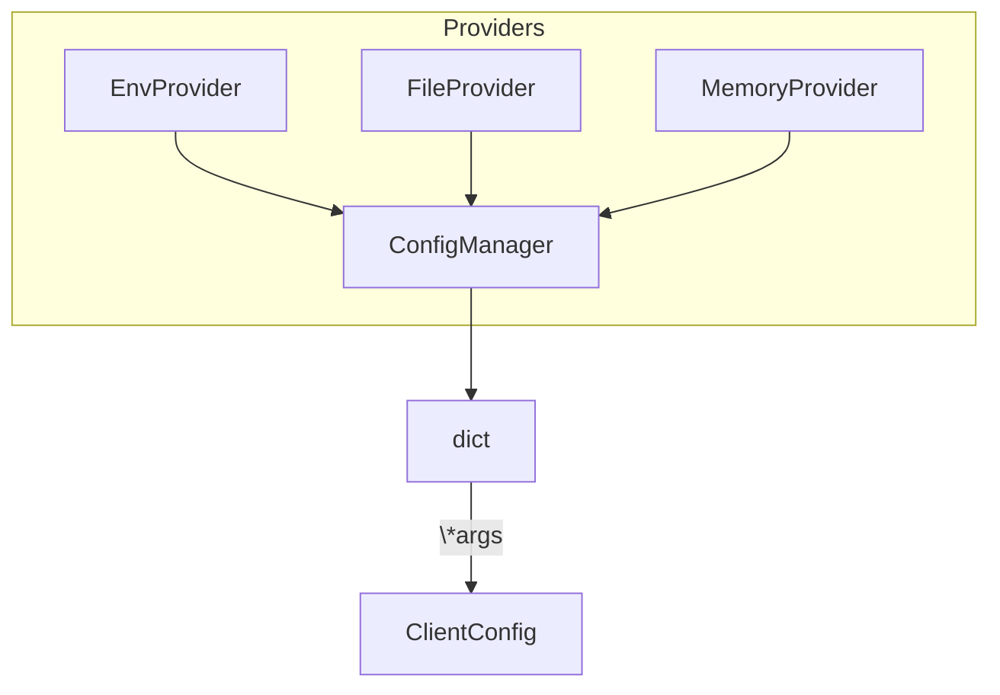

# apiconfig.config

Core configuration system for **apiconfig**.  This module exposes the `ClientConfig`
class used by API clients and the `ConfigManager` which coordinates loading of
configuration values from one or more providers.

## Contents
- `base.py` – `ClientConfig` with helpers for merging settings and constructing `base_url`.
- `manager.py` – `ConfigManager` that merges dictionaries from multiple providers.
- `providers/` – built‑in configuration providers such as `EnvProvider` and `FileProvider`.
- `__init__.py` – re‑exports the main classes for convenience.

## Example usage
```python
from apiconfig.config import ClientConfig, ConfigManager
from apiconfig.config.providers import EnvProvider, FileProvider

providers = [EnvProvider(prefix="MYAPP_"), FileProvider("config.json")]
manager = ConfigManager(providers)
config_data = manager.load_config()

config = ClientConfig(**config_data)
print(config.base_url)
```

## Key classes
| Class | Description |
| ----- | ----------- |
| `ClientConfig` | Stores hostname, API version, headers, timeouts and authentication strategy. |
| `ConfigManager` | Loads configuration from providers and merges them in order. |
| `EnvProvider` / `FileProvider` / `MemoryProvider` | Return configuration dictionaries from environment, JSON files or in‑memory data. |

### Design
The manager and providers follow a simple **Strategy** style. Each provider
defines a `load()` (or `get_config()`) method returning a dictionary. The
`ConfigManager` merges these dictionaries in sequence so later providers override
previous ones.



## Tests
Install dependencies and run the unit tests for the configuration package:
```bash
poetry install --with dev
poetry run pytest tests/unit/config -q
```

## Status
Stable – used by API clients and covered by unit tests.

### Maintenance Notes
- Considered stable with occasional updates for new configuration sources.

### Changelog
- See the project changelog for release notes affecting configuration behavior.

### Future Considerations
- Potential support for dynamic configuration providers.

## Navigation
- [apiconfig](../README.md)
- [providers](./providers/README.md)

## See Also
- [auth](../auth/README.md) - describes available authentication strategies used by `ClientConfig`.
- [exceptions](../exceptions/README.md) - lists configuration-related errors raised when loading settings.
