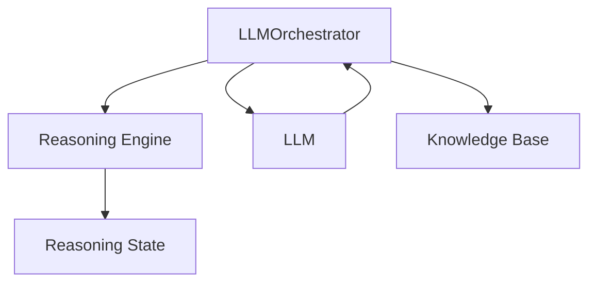

```mermaid
flowchart TD
    A[LLMOrchestrator]
    B[Reasoning Engine]
    C[LLM]
    D[Knowledge Base]
    E[Reasoning State]

    A --> B
    A --> C
    A --> D
    B --> E
    C --> A

    %% Explanations:
    %% - LLMOrchestrator coordinates the reasoning process, interacts with the Reasoning Engine, LLM Pipeline, and loads the Knowledge Base.
    %% - Reasoning Engine performs logical inference using the Knowledge Base and maintains its own State.
    %% - LLM Pipeline is used by the orchestrator for fact extraction and prompt handling.
    %% - Knowledge Base contains rules, predicates, and variables used by the Reasoning Engine.
    %% - State is managed exclusively by the Reasoning Engine to track reasoning progress.
```
