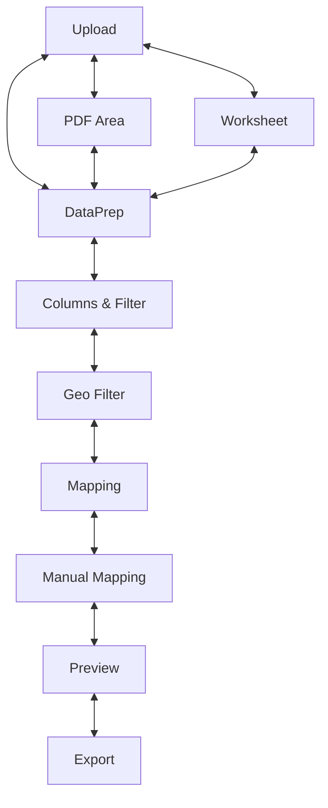

<p align="center">
  
</p>

         

# Geo-Importer

Geo-Importer is a simple desktop app built with PySide6. You can upload your statistics in Excel, CSV, or PDF formats, extract and clean the tables, and then match your data to geographic regions (NUTS levels 0–3, LAU, LOR). Finally, you can export the matched data as CSV or GeoJSON.

----------

## Table of Contents

-   [Features](#features)
    
-   [Project Layout](#project-layout)
    
-   [Quick Start](#quick-start)
    
    -   [Run Locally](#run-locally)
        
    -   [Build & Install](#build--install)
        
    -   [Publish to PyPI](#publish-to-pypi)
        
-   [Documentation](#documentation)
    
-   [License](#license)
    

----------

## Features

Geo-Importer guides you step-by-step through:

1.  **Upload** – load Excel, CSV or PDF files
    
2.  **PDF Area** – select table regions in PDFs
    
3.  **Worksheet** – choose an Excel sheet
    
4.  **Data Prep** – clean and trim your data
    
5.  **Columns & Filter** – pick columns and apply filters
    
6.  **Geo Filter** – filter reference geodata (NUTS/LAU)
    
7.  **Mapping** – auto-match statistics to regions
    
8.  **Manual Mapping** – adjust any unmatched rows
    
9.  **Preview** – view results on an interactive map
    
10.  **Export** – save as CSV or GeoJSON
    


A shared `DataStore` keeps intermediate results so each step stays decoupled. Core logic lives in `src/core`, and the Qt views are under `src/views`.

----------

## Project Layout
```
geo-importer/
├── src/               # Code packages
│   ├── core/          # Workflow logic & DataStore
│   ├── views/         # Qt UI for each step
│   ├── mapper/        # Matching algorithms & widgets
│   ├── models/        # Qt model classes
│   ├── geodata/       # Built-in reference CSVs
│   └── main.py        # Entry point
├── data/              # Sample tables for testing
├── static/            # Generated assets
├── tests/             # Unit tests
└── docs/              # MkDocs site
```

----------

## Quick Start

Clone the repo and enter the folder:
```bash
git clone https://github.com/frievoe97/geo-importer.git
cd geo-importer
```

### Run Locally

1.  Create a Python 3.12+ virtual env and install:
    ```bash
    python3.12 -m venv .venv
    source .venv/bin/activate    # Windows: .venv\Scripts\activate
    pip install .
    ```
    
2.  Launch the GUI:
    ```bash
    python main.py
    ```
    
3.  Run tests:
    ```bash
    pytest -v
    ```
    
4.  Clean up:
    ```bash
    deactivate
    rm -rf .venv dist build geo_importer.egg-info
    ```
    

### Build & Install Locally

1.  Prepare env and install build tools:
    ```bash
    python3.12 -m venv .venv
    source .venv/bin/activate
    pip install .
    pip install --upgrade build
    ```
    
2.  Build package:
    ```bash
    python -m build
    ```
    
3.  Install wheel & run:
    ```bash
    pip install dist/geo_importer-*.whl
    geo-importer
    ```
    
4.  Test and clean up as above.
    

### Publish to PyPI

1.  Build wheel and install twine:
    ```bash
    python3.12 -m venv .venv
    source .venv/bin/activate
    pip install --upgrade build twine
    python -m build
    ```
    
2.  Upload:
    ```bash
    twine upload dist/*
    ```
    
3.  Clean up `.venv`, `dist/`, `build/`.

----------

### Automated publishing via GitHub Actions

1. Add your PyPI API key as the `PYPI_API_TOKEN` secret in the GitHub repository
2. Bump the version in `pyproject.toml` and `src/main.py` using the helper script:

```bash
scripts/bump_version.py 0.0.1b910
```

3. Commit the changes on your `release` branch and create a tag that starts with `v`:

```bash
git tag v0.0.1b910
git push origin release --tags
```

Pushing the tag triggers `.github/workflows/pypi.yml`. It runs the test suite,
builds the wheel and uploads the package to PyPI automatically.

## Documentation

Run the helper script to generate API docs and serve them locally via MkDocs:

```bash
python generate_api_docs.py
mkdocs serve -f docs/mkdocs.yml
```

----------

## Code Formatting & Cleanup

You can automatically format and lint the codebase locally using Black and Ruff:
```bash
# Format all Python files
black src tests main.py

# Apply Ruff fixes (if any)
ruff check .
```

----------

## Documentation

Generate and serve docs:
```bash
python generate_api_docs.py
mkdocs serve -f docs/mkdocs.yml
```

Docs auto-publish to GitHub Pages on release tags.

----------

## License

Distributed under the MIT License. See LICENSE for details.
