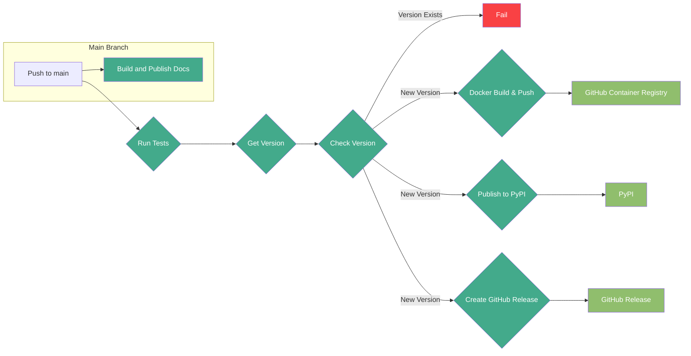
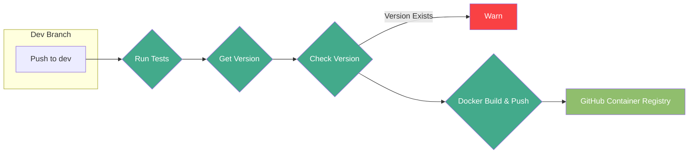
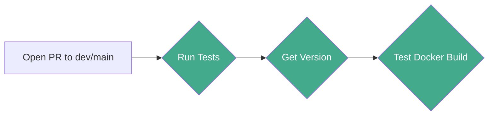

# hecstac

[](https://github.com/fema-ffrd/hecstac/actions/workflows/main-push.yaml)
[](https://github.com/fema-ffrd/hecstac/actions/workflows/dev-push.yaml)
[](https://hecstac.readthedocs.io/en/latest/?badge=latest)
[](https://badge.fury.io/py/hecstac)

Utilities for creating STAC items from HEC models

**hecstac** is an open-source Python library designed to mine metadata from HEC model simulations for use in the development of catalogs documenting probabilistic flood studies. This project automates the generation of STAC Items and Assets from HEC-HMS and HEC-RAS model files, enabling improved data and metadata management.

## Installation

This package may be installed using pip with the following command

```
$ pip install hecstac
```

## Developer Setup

Create a virtual environment in the project directory:

```
$ python -m venv venv
```

Activate the virtual environment:

```
# For macOS/Linux
$ source ./venv/bin/activate
(venv) $

# For Windows
> ./venv/Scripts/activate
```

Install dev dependencies:

```
(venv) $ pip install ".[dev]"
```

**_Testing HEC-RAS model item creation_**

- Download the HEC-RAS example project data from USACE. The data can be downloaded [here](https://github.com/HydrologicEngineeringCenter/hec-downloads/releases/download/1.0.33/Example_Projects_6_6.zip).

- Per the [examples](https://hecstac.readthedocs.io/en/latest/user_guide.html), set the ras_project_file to the path of the 2D Muncie project file (ex. ras_project_file = `Example_Projects_6_6/2D Unsteady Flow Hydraulics/Muncie/Muncie.prj`).

- For projects that have projection information within the geometry .hdf files, the CRS info can automatically be detected. The Muncie data lacks that projection info so it must be set by extracting the WKT projection string and setting the CRS in 'new_ras_item.py' to the projection string. The projection can be found in the Muncie/GIS_Data folder in Muncie_IA_Clip.prj.

- Once the CRS and project file location have been set, a new item can be created with 'python -m new_ras_item' in the command line. The new item will be added inside the model directory at the same level as the project file.

## FFRD

While `hecstac` was created principally in support of FFRD pilot projects, the ability to create STAC based metadata items for HEC models (RAS and HMS in particular) has guided some design and implementation decisions that make it flexible enough to support more generalized use cases.

There will be modules and workflows that are very specifically designed for FFRD, and those will be generally distinguishable via _ffrd_ in the name of the file / class function / etc. The Dockerfiles that are included in the repo are designed specifically in support of these pilots, and as such are not meant for general “out-of-the-box” use cases. For specifics on FFRD use cases please see the documentation.

## CI/CD Pipeline

The CI/CD pipeline is managed with GitHub Actions and automates the build, test, and release processes.

### Push to `main` CI/CD Process Diagram



### Push to `dev` CI/CD Process Diagram



### Open PR to `dev`/`main` CI/CD Process Diagram



### Docs

The `Read the Docs` build and publish step is triggered on push to the `main` branch and handled externally by `Read the Docs`.
