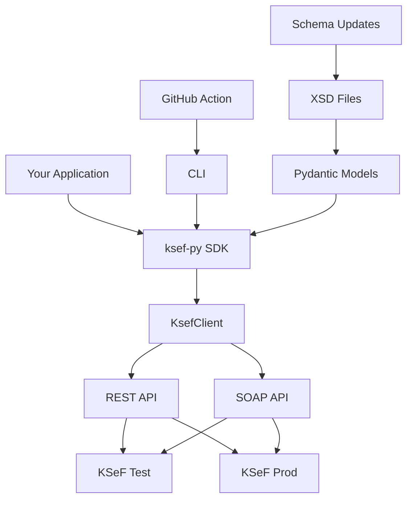

# ksef-py

*A modern Python SDK + CLI for Poland's National e-Invoice System (KSeF)*

[](https://github.com/Kamil-Dab/ksef-py/actions)
[](https://codecov.io/gh/Kamil-Dab/ksef-py)
[](https://badge.fury.io/py/ksef-py)
[](https://pypi.org/project/ksef-py/)
[](https://opensource.org/licenses/MIT)

> ⚠️ **Important**: KSeF will become **mandatory for large taxpayers on 1 February 2026, and for everyone else on 1 April 2026**. Start your integration now!

## 🚀 Quick Start

```bash
# Install via pip
pip install ksef-py

# Or with Poetry
poetry add ksef-py
```

```python
from ksef import KsefClient
from pathlib import Path

# Initialize client
client = KsefClient(
    nip="1234567890",
    env="test",  # "test" or "prod"
    token_path="~/tokens/ksef.jwt"
)

# Send an invoice
xml = Path("invoice_FA3.xml").read_text()
ksef_nr = await client.send_invoice(xml)

# Check status
status = await client.get_status(ksef_nr)

# Download PDF
pdf_path = await client.download(ksef_nr, format="pdf")

print(f"✅ Sent! KSeF no: {ksef_nr}")
print(f"📄 Status: {status}")
print(f"💾 PDF saved to: {pdf_path}")
```

## 🛠️ CLI Usage

```bash
# Send an invoice
ksef send invoice.xml --nip 1234567890 --env test

# Check invoice status
ksef status KSEF:2025:PL/123/ABC... --nip 1234567890

# Download invoice
ksef download KSEF:2025:PL/123/ABC... --nip 1234567890 --format pdf

# Validate XML before sending
ksef validate invoice.xml

# Start local stub server for development
ksef stub-server --port 8000
```

## 📋 Features

### Core SDK
- **🔄 Async-first** design with `httpx` for modern Python applications
- **🔐 Flexible authentication** - token-based or challenge-file methods
- **🛡️ Strong typing** with Pydantic models generated from official XSD schemas
- **🔁 Automatic retries** with exponential backoff
- **📝 Comprehensive logging** and error handling
- **🌐 Both REST and SOAP** endpoint support

### CLI Tools
- **📤 Send invoices** with progress indicators and beautiful output
- **📊 Check status** with formatted tables
- **💾 Download files** in PDF or XML format
- **✅ Validate XML** against official KSeF schemas
- **🧪 Local stub server** for offline development and testing

### Developer Experience
- **🧪 Offline testing** with mock server
- **📚 Auto-updating schemas** from Ministry of Finance
- **🚨 GitHub Action** for XML validation in CI/CD
- **📖 Rich documentation** and examples
- **🔍 Full mypy and ruff support**

## 📦 Installation

### Basic Installation

```bash
pip install ksef-py
```

### Development Installation

```bash
# Clone the repository  
git clone https://github.com/Kamil-Dab/ksef-py.git
cd ksef-py

# Install with Poetry
poetry install

# Install pre-commit hooks
poetry run pre-commit install
```

### Docker

```bash
# Run CLI in Docker
docker run --rm -v $(pwd):/workspace ksef-py:latest \
  ksef send /workspace/invoice.xml --nip 1234567890
```

## 🔧 Configuration

### Environment Variables

```bash
export KSEF_NIP=1234567890
export KSEF_ENV=test  # or prod
export KSEF_TOKEN_PATH=~/.ksef/token.jwt
```

### Configuration File

Create `~/.ksef/config.toml`:

```toml
[default]
nip = "1234567890"
environment = "test"
token_path = "~/.ksef/token.jwt"

[test]
base_url = "https://ksef-test.mf.gov.pl/api"
timeout = 30

[prod]
base_url = "https://ksef.mf.gov.pl/api"
timeout = 60
```

## 🏗️ Architecture



## 📚 API Reference

### KsefClient

The main client class for interacting with KSeF API.

#### Methods

##### `__init__(nip, env="test", token_path=None, **kwargs)`

Initialize the KSeF client.

- `nip` (str): Company NIP number (10 digits)
- `env` (str): Environment - "test" or "prod"
- `token_path` (str, optional): Path to JWT token file
- `private_key_path` (str, optional): Path to private key for signing
- `certificate_path` (str, optional): Path to certificate

##### `async send_invoice(xml_content, filename=None) -> str`

Send an invoice to KSeF.

- `xml_content` (str): Invoice XML content
- `filename` (str, optional): Original filename
- Returns: KSeF number assigned to the invoice

##### `async get_status(ksef_number) -> InvoiceStatus`

Get status of an invoice.

- `ksef_number` (str): KSeF number to check
- Returns: Current status (Accepted, Rejected, Pending, Error)

##### `async download(ksef_number, format="pdf", output_path=None) -> Path`

Download an invoice.

- `ksef_number` (str): KSeF number to download
- `format` (str): Download format - "pdf" or "xml"
- `output_path` (str, optional): Where to save the file
- Returns: Path to downloaded file

### Models

Key Pydantic models for type safety:

```python
from ksef.models import (
    KsefEnvironment,      # "test" | "prod"
    InvoiceStatus,        # "Accepted" | "Rejected" | "Pending" | "Error" 
    InvoiceFormat,        # "pdf" | "xml"
    KsefCredentials,      # Authentication configuration
    TokenResponse,        # JWT token response
    InvoiceSendRequest,   # Invoice submission data
    InvoiceStatusResponse # Status check response
)
```

## 🧪 Testing

Run the test suite:

```bash
# Run all tests
poetry run pytest

# Run with coverage
poetry run pytest --cov=ksef --cov-report=html

# Run specific test file
poetry run pytest tests/test_client.py

# Run integration tests (requires test environment)
poetry run pytest tests/integration/ --env=test
```

### Using the Stub Server

For offline development and testing:

```bash
# Start stub server
poetry run ksef stub-server --port 8000

# In another terminal, use it for testing
export KSEF_BASE_URL=http://localhost:8000
poetry run pytest tests/
```

## 🚀 GitHub Action

Add KSeF XML validation to your CI/CD pipeline:

```yaml
# .github/workflows/validate-invoices.yml
name: Validate Invoices

on:
  pull_request:
    paths: ['invoices/**/*.xml']

jobs:
  validate:
    runs-on: ubuntu-latest
    steps:
    - uses: actions/checkout@v4
    
    - name: Set up Python
      uses: actions/setup-python@v4
      with:
        python-version: '3.11'
    
    - name: Install ksef-py
      run: pip install ksef-py
    
    - name: Validate invoices
      run: |
        find invoices/ -name "*.xml" -exec ksef validate {} \;
```

## 🤝 Contributing

We welcome contributions! Please see our [Contributing Guide](CONTRIBUTING.md) for details.

### Development Setup

```bash
# Clone and setup
git clone https://github.com/Kamil-Dab/ksef-py.git
cd ksef-py
poetry install --with dev

# Run linting
poetry run ruff check .
poetry run ruff format .
poetry run mypy ksef/

# Run tests
poetry run pytest
```

### Adding Features

1. 🍴 Fork the repository
2. 🌿 Create a feature branch (`git checkout -b feature/amazing-feature`)
3. 💫 Make your changes with tests
4. ✅ Ensure all tests pass
5. 📝 Update documentation
6. 🚀 Submit a pull request

## 📋 Roadmap

### v0.1.0 (Current)
- [x] Basic REST API client
- [x] CLI with send/status/download commands  
- [x] Token-based authentication
- [x] Pydantic models and validation
- [x] Comprehensive test suite
- [x] GitHub Actions integration

### v0.2.0 (Next)
- [ ] SOAP endpoint support with Zeep
- [ ] Challenge-file authentication method
- [ ] Advanced retry strategies
- [ ] Reference data caching
- [ ] Batch operations support

### v0.3.0 (Future)
- [ ] Full XSD → Pydantic model generation
- [ ] WebSocket support for real-time updates
- [ ] Plugin system for custom integrations
- [ ] Advanced reporting and analytics
- [ ] Desktop GUI application

## 📄 License

This project is licensed under the MIT License - see the [LICENSE](LICENSE) file for details.

## 🆘 Support

- 🐛 **Issues**: https://github.com/Kamil-Dab/ksef-py/issues
- 💬 **Discussions**: https://github.com/Kamil-Dab/ksef-py/discussions

## 🙏 Acknowledgments

- Polish Ministry of Finance for the KSeF system and API documentation
- The Python community for excellent async and HTTP libraries
- Contributors and early adopters providing feedback

---

**Made with ❤️ for the Polish business community**

*Get ready for mandatory e-invoicing in 2026! 🇵🇱*