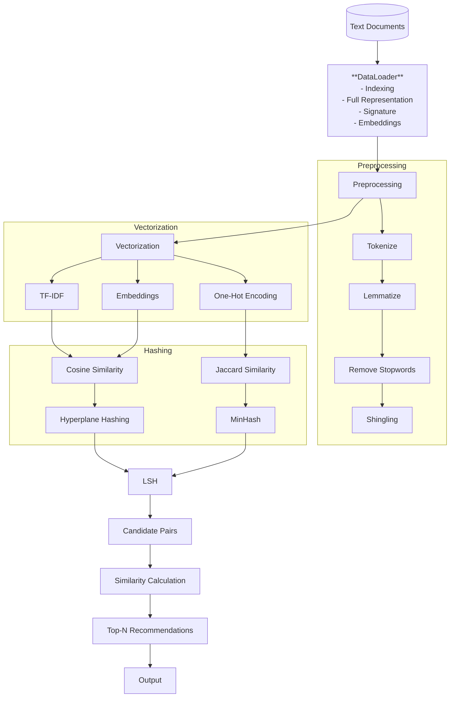

# Locality Sensitive Hashing Recommendation System

[](LICENSE)
[](https://www.python.org/downloads/)
[](https://pypi.org/project/locality-sensitive-hashing-recommendation-system/)
[](https://github.com/mxngjxa/lshrs/actions/workflows/lint.yml)
[](https://github.com/mxngjxa/lshrs/deployments)
[](https://github.com/astral-sh/ruff)
[](https://pypi.org/project/lshrs/)
[](https://GitHub.com/mxngjxa/lshrs/graphs/contributors/)
[](https://GitHub.com/mxngjxa/lshrs/graphs/commit-activity)

A Locality Sensitive Hashing (LSH) based recommendation system for efficient similarity search in Python.

## Table of Contents

- [Project Structure](#project-structure)
- [Installation](#installation)
- [Usage](#usage)
- [Development](#development)
- [Architecture](#architecture)
- [License](#license)
- [Authors](#authors)
- [Changelog](#changelog)
- [Contributing](#contributing)

## Project Structure

The project is organized as follows:

```
.
├── CHANGELOG.md
├── docs
│   ├── api
│   ├── architecture.md
│   ├── examples
│   ├── index.md
│   ├── project_structure.txt
│   └── quickstart.md
├── examples
│   ├── advanced_usage.py
│   └── basic_usage.py
├── LICENSE
├── pyproject.toml
├── README.md
├── src
│   └── lshrs
│       ├── core
│       ├── encoding
│       ├── hashing
│       ├── preprocessing
│       └── utils
└── tests
    ├── fixtures
    ├── integration
    └── unit
```

- **docs**: Contains project documentation.
- **examples**: Contains example scripts for using the library.
- **src/lshrs**: Contains the source code for the `lshrs` library.
- **tests**: Contains unit and integration tests.

## Installation

This project uses [Poetry](https://python-poetry.org/) for dependency management. Here’s how to set up the development environment from scratch.

### 1. Install `pipx` (Recommended)

`pipx` is a tool to help you install and run Python applications in isolated environments. It's the recommended way to install `poetry`.

```bash
python3 -m pip install --user pipx
python3 -m pipx ensurepath
```

After running this, you may need to restart your terminal for the `pipx` command to be available.

### 2. Install Poetry

Once `pipx` is installed, you can use it to install Poetry:

```bash
pipx install poetry
```

### 3. Set Up the Project

Now, you can set up the project itself.

1.  **Clone the repository:**
    ```bash
    git clone https://github.com/mxngjxa/lshrs.git
    cd lshrs
    ```

2.  **macOS Prerequisite: Install `gfortran`**
    If you are on macOS, you will need to install a Fortran compiler for the `scipy` dependency to build correctly. The easiest way is to use [Homebrew](https://brew.sh/):
    ```bash
    brew install gfortran
    ```

3.  **Create a local virtual environment.**
    It's recommended to create a virtual environment in the project's root directory.
    ```bash
    python -m venv .venv
    ```

4.  **Configure Poetry to use the local virtual environment.**
    This step ensures that Poetry installs dependencies into the `.venv` directory you just created.
    ```bash
    poetry config virtualenvs.in-project true
    ```

5.  **Install dependencies.**
    Finally, use Poetry to install the project's dependencies.
    ```bash
    poetry install
    ```
    This will install all the dependencies defined in the `pyproject.toml` file.

## Usage

You can find basic and advanced usage examples in the `examples` directory.

- [`basic_usage.py`](examples/basic_usage.py:1)
- [`advanced_usage.py`](examples/advanced_usage.py:1)

## Development

This project uses `ruff` for linting and formatting.

-   **Linting:** To check for any style issues or errors, run the following command:
    ```bash
    poetry run ruff check src
    ```
-   **Formatting:** To automatically fix any issues that `ruff` finds, run this command:
    ```bash
    poetry run ruff check --fix src
    ```

## Architecture

The following diagram illustrates the architecture of the LSH recommendation system:



## Core Orchestration of the `lshrs` Library

This directory contains the source code for the `lshrs` library, a Python-based recommendation system using Locality Sensitive Hashing (LSH).

### Modules

The `lshrs` library is organized into the following modules:

- [Core](#core)
- [Encoding](#encoding)
- [Hashing](#hashing)
- [Preprocessing](#preprocessing)
- [Utils](#utils)

---

#### Core

The `core` module contains the main components for running the LSH recommendation system.

- **`config.py`**: Defines configuration settings for the application.
- **`dataloader.py`**: Handles loading and preparing data for the LSH process.
- **`exceptions.py`**: Defines custom exception classes for error handling.
- **`interfaces.py`**: Contains interface definitions for different components.
- **`main.py`**: The main entry point for running the LSH recommendation system.

---

#### Encoding

The `encoding` module provides different methods for vectorizing text data.

- **`embedding.py`**: Implements word embedding techniques.
- **`main.py`**: Main script for handling encoding processes.
- **`onehot.py`**: Implements one-hot encoding.
- **`tfidf.py`**: Implements TF-IDF (Term Frequency-Inverse Document Frequency) vectorization.

---

#### Hashing

The `hashing` module contains different hashing algorithms used in LSH.

- **`hyperplane.py`**: Implements hyperplane-based hashing for cosine similarity.
- **`lsh.py`**: The main LSH implementation that combines hashing and candidate selection.
- **`minhash.py`**: Implements MinHash for Jaccard similarity.

---

#### Preprocessing

The `preprocessing` module provides tools for cleaning and preparing text data.

- **`lemmatize.py`**: Implements lemmatization to reduce words to their base form.
- **`shingling.py`**: Implements shingling to create k-shingles from text.
- **`stopwords.py`**: Provides functionality for removing stopwords.
- **`website.py`**: Contains functions for preprocessing website content.

---

#### Utils

The `utils` module contains helper functions and utilities used across the library.

- **`br.py`**: Implements the band-and-row (BR) technique for LSH.
- **`helpers.py`**: Contains general helper functions.
- **`save.py`**: Provides functionality for saving and loading data.
- **`similarity.py`**: Contains functions for calculating similarity between vectors.

---

## License

This project is licensed under the MIT License. See the [`LICENSE`](LICENSE:1) file for details.

## Authors

- Y. Zhao ([yimingzhao936@gmail.com](mailto:yimingzhao936@gmail.com))
- M. Guan ([mingjia.guan@outlook.com](mailto:mingjia.guan@outlook.com))

## Changelog

See the [`CHANGELOG.md`](CHANGELOG.md:1) file for a history of changes to the project.

## Contributing

Contributions are welcome! Please see the [Development](#development) section for linting and formatting guidelines.