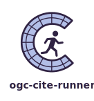

<style>
  .md-typeset h1,
  .md-content__button {
    display: none;
  }
</style>

<figure markdown="span">
  
</figure>

A test runner for [OGC CITE:material-open-in-new:]{: target="blank_" }.

Key features:

- **Runs as a github action**: Can be integrated into existing CI workflows
- **Runs as a standalone CLI application**: Can be run as a standalone tool
- **Multiple output formats**: Can output test suite results as straight to the terminal, in Markdown,
  JSON or XML

This project aims to simplify the running of OGC CITE tests suites so that
server implementations of OGC standards may ensure their compliance with them
more frequently.

[OGC CITE:material-open-in-new:]: https://github.com/opengeospatial/cite/wiki


## Examples

Integrate into your CI as a github action:

```yaml
jobs:
  perform-cite-testing:
    runs-on: ubuntu-24.04
    steps:
      - name: test ogcapi-features compliancy
        uses: OSGeo/ogc-cite-runner@v0.2.0
        with:
          test_suite_identifier: ogcapi-features-1.0
          test_session_arguments: iut=http://host.docker.internal:5001
```

Run the same test suite as a standalone CLI application:

```shell
docker pull ogccite/teamengine-production:1.0-SNAPSHOT
docker run \
    --rm \
    --name=teamengine \
    --add-host=host.docker.internal:host-gateway \
    --publish=9080:8080 \
    ogccite/teamengine-production:1.0-SNAPSHOT

pipx install ogc-cite-runner

ogc-cite-runner execute-test-suite \
    http://localhost:8080/teamengine \
    ogcapi-features-1.0 \
    --test-suite-input iut http://host.docker.internal:5001
```


## License

ogc-cite-runner is published under an [MIT license:material-open-in-new:]{: target="blank_" }.


[MIT license:material-open-in-new:]: https://github.com/OSGeo/cite-runner/blob/main/LICENSE
