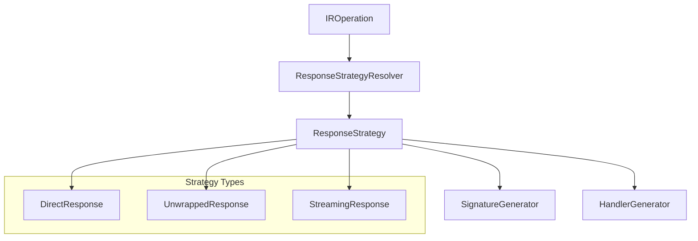
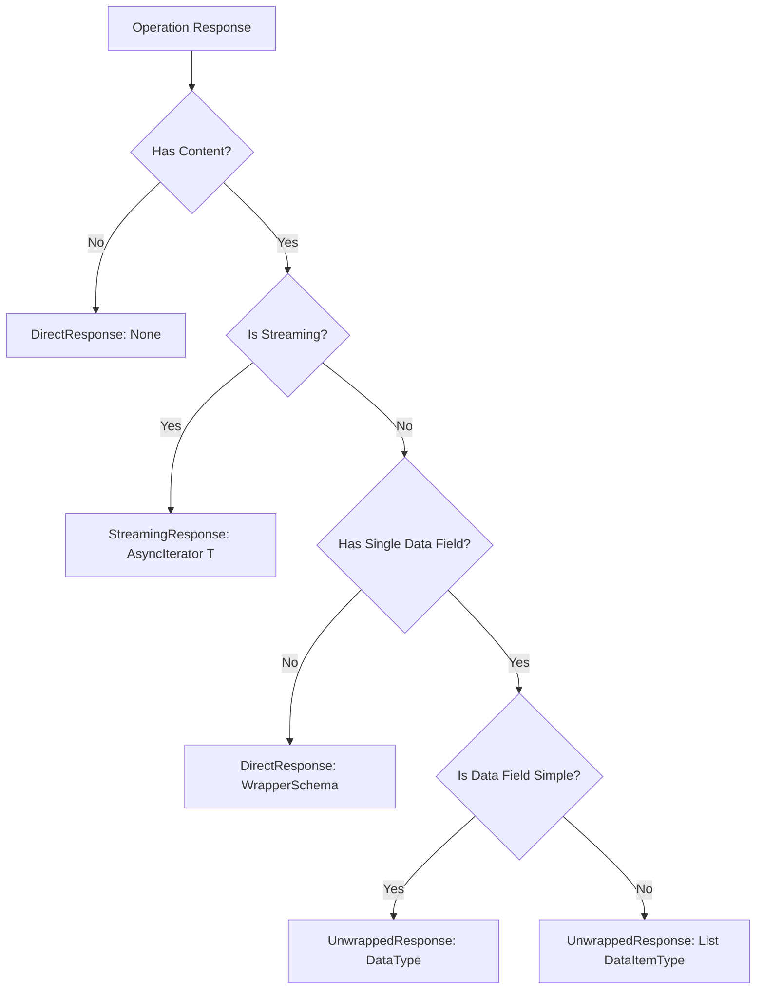

# Response Resolution Architecture Refactor

## Current Problems

1. **Multiple sources of truth** for response types and unwrapping
2. **Inconsistent naming** leading to `Data_` vs proper schema names
3. **Scattered responsibility** across response resolver, signature generator, and response handler
4. **Fragile unwrapping logic** that breaks when schemas change

## Proposed Architecture

### Single Responsibility Principle



### Core Components

#### 1. ResponseStrategy (New)
```python
@dataclass
class ResponseStrategy:
    """Unified strategy for handling a specific operation's response."""
    return_type: str                    # The Python type for method signature
    needs_unwrapping: bool             # Whether to unwrap data field
    unwrap_field: str | None           # Which field to unwrap ("data", etc.)
    target_schema: IRSchema            # The final schema to deserialize to
    wrapper_schema: IRSchema | None    # The wrapper schema (if any)
    is_streaming: bool                 # Whether this is a streaming response
    
class ResponseStrategyResolver:
    """Single source of truth for response handling decisions."""
    
    def resolve(self, operation: IROperation, context: RenderContext) -> ResponseStrategy:
        """Determine how to handle this operation's response."""
```

#### 2. Updated Components Use Strategy

```python
class EndpointMethodSignatureGenerator:
    def generate_signature(self, ..., strategy: ResponseStrategy):
        # Use strategy.return_type for signature
        
class EndpointResponseHandlerGenerator:
    def generate_response_handling(self, ..., strategy: ResponseStrategy):
        # Use strategy to determine unwrapping and deserialization
```

### Response Strategy Decision Tree



### Benefits

1. **Single Decision Point**: Only `ResponseStrategyResolver` decides unwrapping
2. **Consistent Implementation**: All generators use the same strategy
3. **Clear Schema Names**: Proper schema names instead of `Data_` 
4. **Testable**: Easy to test strategy resolution separately
5. **Maintainable**: Changes only need to be made in one place

### Migration Plan

1. Create `ResponseStrategy` and `ResponseStrategyResolver`
2. Update `EndpointMethodGenerator` to resolve strategy once
3. Pass strategy to signature and handler generators
4. Remove scattered unwrapping logic from type service
5. Update tests to verify consistent behavior

## Implementation Steps

### Step 1: Create Strategy Classes
```python
# New file: src/pyopenapi_gen/types/strategies/response_strategy.py

@dataclass
class ResponseStrategy:
    return_type: str
    needs_unwrapping: bool
    unwrap_field: str | None
    target_schema: IRSchema
    wrapper_schema: IRSchema | None
    is_streaming: bool

class ResponseStrategyResolver:
    def __init__(self, schemas: Dict[str, IRSchema]):
        self.schemas = schemas
        self.type_service = UnifiedTypeService(schemas)
    
    def resolve(self, operation: IROperation, context: RenderContext) -> ResponseStrategy:
        # Single place for all response resolution logic
```

### Step 2: Update Method Generator
```python
class EndpointMethodGenerator:
    def generate(self, op: IROperation, context: RenderContext) -> str:
        # Resolve strategy once
        strategy = ResponseStrategyResolver(self.schemas).resolve(op, context)
        
        # Pass strategy to generators
        self.signature_generator.generate_signature(writer, op, context, ordered_params, strategy)
        self.response_handler_generator.generate_response_handling(writer, op, context, strategy)
```

### Step 3: Clean Up Type Service
- Remove automatic unwrapping from `UnifiedTypeService`
- Make it focus purely on schema-to-type conversion
- Remove scattered unwrapping logic

This will make the system much more maintainable and eliminate the recurring `Data_` vs proper schema name issues.