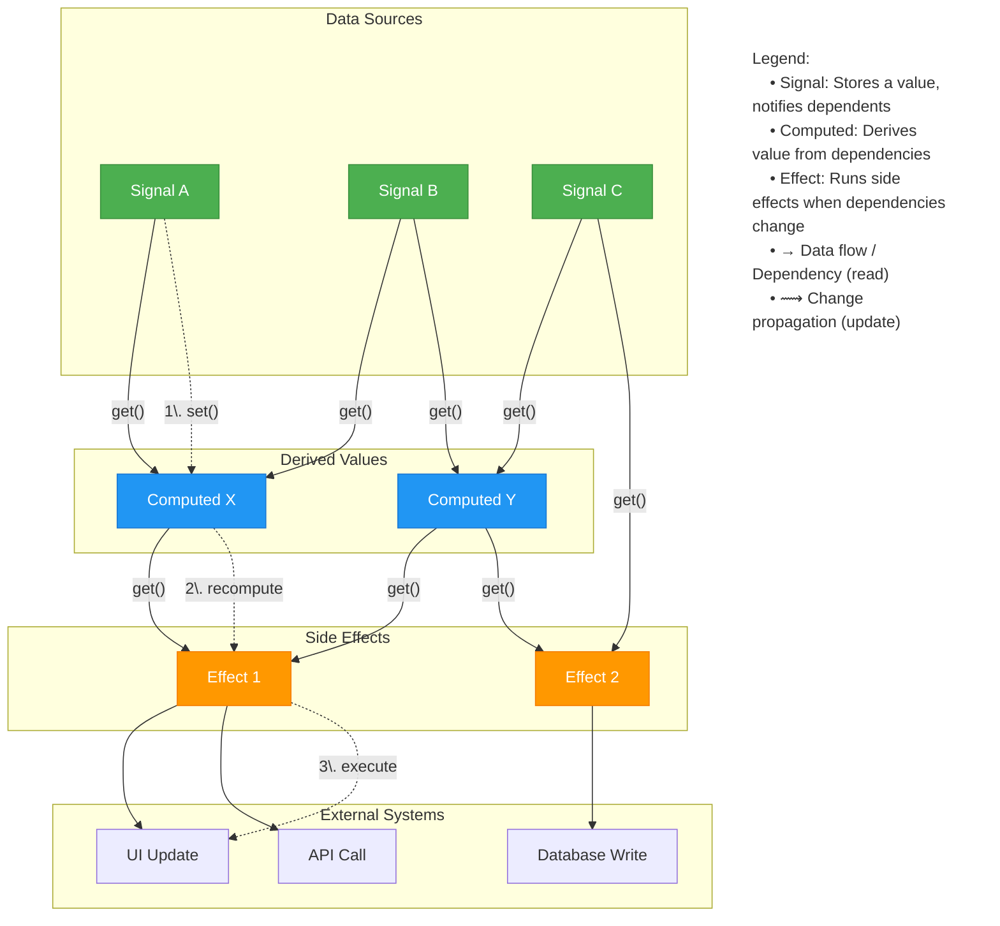

# reaktiv

 [](https://pypi.org/project/reaktiv/)    [](https://microsoft.github.io/pyright/)

**Reactive Computation Graphs for Python** with first-class async support, inspired by Angular's reactivity model.


## Installation

```bash
pip install reaktiv
# or with uv
uv pip install reaktiv
```

`reaktiv` creates efficient reactive computation graphs that only recalculate values when their dependencies change. The system automatically tracks dependencies between signals, computed values, and effects, eliminating the need for manual subscription management.

**Key features:**
- 🔄 **Efficient computation graph**: Only recomputes values affected by a change
- 🔍 **Automatic dependency tracking**: Dependencies are discovered at runtime
- 🧠 **Intelligent memoization**: Computed values are cached until dependencies change
- 🔌 **Side effects via subscriptions**: Changes propagate to effects for integration with external systems
- ⚡ **Async-first design**: Built for Python's asyncio ecosystem

## Documentation

Full documentation is available at [https://reaktiv.readthedocs.io/](https://reaktiv.readthedocs.io/).

For a comprehensive guide on reactive state management concepts, check out [The Missing Manual for Signals: State Management for Python Developers](https://bui.app/the-missing-manual-for-signals-state-management-for-python-developers/).

## Quick Start

### Basic Reactivity

```python
from reaktiv import Signal, Computed, Effect

# Create some signals
name = Signal("Alice")
age = Signal(30)
city = Signal("New York")

# Computed value with automatically tracked dependencies
# The system detects that this depends on name and age
greeting = Computed(lambda: f"{name()} is {age()} years old")

# Another computed value with different dependencies
# The system detects this depends only on name and city
location = Computed(lambda: f"{name()} lives in {city()}")

# Create effects to demonstrate updates
print("Initial Setup:")
greeting_effect = Effect(lambda: print(f"Greeting: {greeting()}"))
location_effect = Effect(lambda: print(f"Location: {location()}"))

# Changing age only triggers recomputation of greeting
print("\nChanging age to 31:")
age.set(31)
# Only greeting recomputed (location unaffected)

# Changing city only triggers recomputation of location
print("\nChanging city to Boston:")
city.set("Boston")
# Only location recomputed (greeting unaffected)

# Changing name triggers recomputation of both derived values
print("\nChanging name to Bob:")
name.set("Bob")
# Both greeting and location recomputed
```

### Using `update()`

Instead of calling `set(new_value)`, `update()` lets you modify a signal based on its current value.

```python
from reaktiv import Signal

counter = Signal(0)

# Standard way
counter.set(counter() + 1)

# Using update() for cleaner syntax
counter.update(lambda x: x + 1)

print(counter())  # 2
```

### Computed Values

```python
from reaktiv import Signal, Computed

# Synchronous context example
price = Signal(100)
tax_rate = Signal(0.2)
total = Computed(lambda: price() * (1 + tax_rate()))

print(total())  # 120.0
tax_rate.set(0.25)
print(total())  # 125.0
```

### Type Safety

`reaktiv` provides full type hint support, making it compatible with static type checkers. This enables better IDE autocompletion, early error detection, and improved code maintainability.

```python
from reaktiv import Signal, Computed

# Signals with explicit type annotations
name: Signal[str] = Signal("Alice")
age: Signal[int] = Signal(30)

# Alternative constructor syntax with type parameters
active = Signal[bool](True)

# Type inference works automatically
inferred_list = Signal([1, 2, 3])  # Inferred as Signal[list[int]]

# Computed values preserve type information
name_length: Computed[int] = Computed(lambda: len(name()))
full_info: Computed[str] = Computed(lambda: f"{name()}, {age()} years old")

# Computed values also get inferred automatically
inferred_computed = Computed(lambda: name().upper())  # Inferred as Computed[str]
inferred_calc = Computed(lambda: age() * 2)  # Inferred as Computed[int]

# Parameter and return types in update functions
def increment_age(current: int) -> int:
    return current + 1

age.update(increment_age)
```

Type hints ensure that your reactive code is checked at development time, reducing runtime errors and making refactoring safer.

## Core Concepts



## How it Works

`reaktiv` provides three core primitives:

1. **Signals**: Store a value and notify dependents when it changes
2. **Computed Signals**: Derive values that automatically update when dependencies change
3. **Effects**: Run side effects when signals or computed signals change

## Why reaktiv?

If you've worked with modern frontend frameworks like React, Vue, SolidJS or Angular, you're familiar with the power of reactive state management. The idea is simple but transformative: when data changes, everything that depends on it updates automatically. 

While this pattern revolutionized frontend development, **its benefits are equally powerful in backend systems** where complex state management is often overlooked or implemented with brittle, ad-hoc solutions.

`reaktiv` brings these **reactive programming** advantages to your Python backend projects:

- **Automatic state dependency tracking:** No more manually tracing which components need updating when data changes
- **Declarative state relationships:** Define how data is transformed once, not every time it changes
- **Efficient fine-grained updates:** Only recompute what actually needs to change
- **Async-first design:** Seamlessly integrates with Python's `asyncio` for managing real-time data flows
- **Zero external dependencies:** Lightweight with minimal overhead
- **Type-safe:** Fully annotated for clarity and maintainability

## Benefits for Backend Development

`reaktiv` addresses key challenges in backend state management:

1. **Eliminates manual dependency tracking**: No more forgotten update logic when state changes
2. **Prevents state synchronization bugs**: Updates happen automatically and consistently
3. **Improves performance**: Only affected computations are recalculated
4. **Reduces cognitive load**: Declare relationships once, not throughout your codebase
5. **Simplifies testing**: Clean separation of state, derivation, and effects

Even in "stateless" architectures, ephemeral state still exists during request processing. `reaktiv` helps manage this complexity without the boilerplate of observers, callbacks, or event dispatchers.

## Beyond Pub/Sub: State Management in Backend Systems

Many backend developers view reactive libraries as just another pub/sub system and question their value in "stateless" architectures. However, `reaktiv` addresses fundamentally different problems:

### Traditional Pub/Sub vs. Reaktiv

| Pub/Sub Systems | Reaktiv |
|----------------|---------|
| Message delivery between components | Automatic state dependency tracking |
| Point-to-point or broadcast messaging | Fine-grained computation graphs |
| Manual subscription management | Automatic dependency detection |
| Focus on message transport | Focus on state derivation |
| Stateless by design | Intentional state management |

### State in "Stateless" Systems

Even in "stateless" microservices and serverless functions, state exists during request processing:

- Configuration management
- Request context propagation
- In-memory caching
- Rate limiting and circuit breaking
- Feature flag evaluation
- Connection pooling
- Runtime metrics collection

`reaktiv` helps manage this ephemeral state with less code, fewer bugs, and better maintainability.

## Basic Examples

Here are some simple examples to help you understand reaktiv's benefits:

### Example 1: A Price Calculator

```python
from reaktiv import Signal, Computed, Effect

# Create base values (signals)
price = Signal(10.0)
quantity = Signal(2)
tax_rate = Signal(0.1)  # 10% tax

# Create derived values (computed)
subtotal = Computed(lambda: price() * quantity())
tax = Computed(lambda: subtotal() * tax_rate())
total = Computed(lambda: subtotal() + tax())

# Create a side effect for logging
logger = Effect(lambda: print(f"Order Total: ${total():.2f}"))

# Initial output: "Order Total: $22.00"

# Change the quantity
quantity.set(3)
# Automatically logs: "Order Total: $33.00"

# Change the price
price.set(12.0) 
# Automatically logs: "Order Total: $39.60"

# Change tax rate
tax_rate.set(0.15)
# Automatically logs: "Order Total: $41.40"
```

### Example 2: Simple Status Monitoring

```python
from reaktiv import Signal, Computed, Effect

# Base signals: system metrics
memory_usage = Signal(75)  # percent
cpu_usage = Signal(50)     # percent

# Computed value: system status based on thresholds
system_status = Computed(lambda: 
    "critical" if memory_usage() > 90 or cpu_usage() > 90 else
    "warning" if memory_usage() > 70 or cpu_usage() > 70 else
    "normal"
)

# Effect: alert when system status changes
def alert_on_status():
    status = system_status()
    print(f"System status: {status}")
    if status != "normal":
        print(f"  Memory: {memory_usage()}%, CPU: {cpu_usage()}%")

status_monitor = Effect(alert_on_status)
# Initial output: "System status: warning"
#                "  Memory: 75%, CPU: 50%"

# Simulate memory dropping
memory_usage.set(60)
# Output: "System status: normal"

# Simulate CPU spiking
cpu_usage.set(95)
# Output: "System status: critical"
#         "  Memory: 60%, CPU: 95%" 
```

### Example 2b: Async Status Monitoring

```python
from reaktiv import Signal, Computed, Effect
import asyncio

async def demo_async_monitoring():
    # Base signals: system metrics
    memory_usage = Signal(75)  # percent
    cpu_usage = Signal(50)     # percent

    # Computed value: system status
    system_status = Computed(lambda: 
        "critical" if memory_usage() > 90 or cpu_usage() > 90 else
        "warning" if memory_usage() > 70 or cpu_usage() > 70 else
        "normal"
    )

    # Async effect: alert and take action when status changes
    async def async_alert_handler():
        status = system_status()
        print(f"System status: {status}")
        
        if status == "critical":
            print(f"  Memory: {memory_usage()}%, CPU: {cpu_usage()}%")
            # Simulate sending notification
            await asyncio.sleep(0.1)  # non-blocking wait
            print("  ✉️ Alert notification sent")
            
            # Simulate recovery action
            if cpu_usage() > 90:
                await asyncio.sleep(0.2)  # simulating some async operation
                print("  🔄 Triggered automatic scaling")

    # Register the async effect
    status_monitor = Effect(async_alert_handler)
    print("Starting monitoring...")
    
    # Give effect time to run initially
    await asyncio.sleep(0.2)
    
    # Simulate CPU spike
    print("\nSimulating CPU spike:")
    cpu_usage.set(95)
    await asyncio.sleep(0.5)  # Allow effect to complete
    
    # Simulate recovery
    print("\nSimulating recovery:")
    cpu_usage.set(50)
    memory_usage.set(60)
    await asyncio.sleep(0.2)

asyncio.run(demo_async_monitoring())
```

### Example 3: Configuration Management

```python
from reaktiv import Signal, Computed, Effect

# Different configuration sources
default_config = Signal({"timeout": 30, "retries": 3, "log_level": "INFO"})
user_config = Signal({})

# Effective config combines both sources, with user settings taking precedence
effective_config = Computed(lambda: {**default_config(), **user_config()})

# Log when config changes
config_logger = Effect(lambda: print(f"Active config: {effective_config()}"))
# Initial output: "Active config: {'timeout': 30, 'retries': 3, 'log_level': 'INFO'}"

# When user updates their preferences
user_config.set({"timeout": 60, "log_level": "DEBUG"})
# Automatically logs: "Active config: {'timeout': 60, 'retries': 3, 'log_level': 'DEBUG'}"

# When defaults are updated (e.g., from a config file)
default_config.update(lambda cfg: {**cfg, "retries": 5, "max_connections": 100})
# Automatically logs: "Active config: {'timeout': 60, 'retries': 5, 'log_level': 'DEBUG', 'max_connections': 100}"
```

### Example 4: Simple Caching

```python
from reaktiv import Signal, Computed

# Database simulation
database = {"user1": "Alice", "user2": "Bob"}

# Cache invalidation signal
last_update = Signal(0)  # timestamp or version number

# User data with automatic cache refresh
def fetch_user(user_id):
    # In a real app, this would actually query a database
    return database.get(user_id)

active_user_id = Signal("user1")

# This computed value automatically refreshes when active_user_id changes
# or when the cache is invalidated via last_update
user_data = Computed(lambda: {
    "id": active_user_id(),
    "name": fetch_user(active_user_id()),
    "cache_version": last_update()
})

print(user_data())  # {'id': 'user1', 'name': 'Alice', 'cache_version': 0}

# Switch to another user - cache updates automatically
active_user_id.set("user2")
print(user_data())  # {'id': 'user2', 'name': 'Bob', 'cache_version': 0}

# Backend data changes - we update the database and invalidate cache
database["user2"] = "Robert"
last_update.set(1)  # increment version number
print(user_data())  # {'id': 'user2', 'name': 'Robert', 'cache_version': 1}
```

### Example 5: Processing a Stream of Events

```python
from reaktiv import Signal, Computed, Effect
import time

# Event stream (simulating incoming data)
events = Signal([])

# Compute statistics from the events
event_count = Computed(lambda: len(events()))
recent_events = Computed(lambda: [e for e in events() if time.time() - e["timestamp"] < 60])
error_count = Computed(lambda: len([e for e in events() if e["level"] == "ERROR"]))

# Monitor for problems
def check_errors():
    if error_count() >= 3:
        print(f"ALERT: {error_count()} errors detected in the event stream!")
    
error_monitor = Effect(check_errors)

# Process new events
def add_event(level, message):
    new_event = {"timestamp": time.time(), "level": level, "message": message}
    events.update(lambda current: current + [new_event])

# Simulate incoming events
add_event("INFO", "Application started")
add_event("INFO", "Processing request")
add_event("ERROR", "Database connection failed")
add_event("ERROR", "Retry failed")
add_event("ERROR", "Giving up after 3 attempts")
# Automatically triggers: "ALERT: 3 errors detected in the event stream!"
```

### Example 5b: Async Event Processing Pipeline

```python
from reaktiv import Signal, Computed, Effect
import asyncio
import time

# Demo async event processing
async def demo_async_events():
    # Event stream
    events = Signal([])

    # Derived statistics
    error_count = Computed(lambda: len([e for e in events() if e["level"] == "ERROR"]))
    warning_count = Computed(lambda: len([e for e in events() if e["level"] == "WARNING"]))

    # Async effect for error handling
    async def handle_errors():
        errors = error_count()
        if errors > 0:
            print(f"Found {errors} errors")
            
            # Simulate error processing that takes time
            await asyncio.sleep(0.2)
            
            if errors >= 3:
                print("🚨 Critical error threshold reached")
                await asyncio.sleep(0.1)  # Simulate sending alert
                print("✉️ Error notification dispatched to on-call team")

    # Register async effect
    error_handler = Effect(handle_errors)

    # Function to add events
    async def add_event_async(level, message):
        new_event = {"timestamp": time.time(), "level": level, "message": message}
        events.update(lambda current: current + [new_event])
        # Simulate some processing time
        await asyncio.sleep(0.1)
    print("Starting event monitoring...")
    
    # Add some events
    await add_event_async("INFO", "Application started")
    await add_event_async("INFO", "User logged in")
    await add_event_async("WARNING", "Slow database query detected")
    
    # Add error events that will trigger our effect
    print("\nSimulating error condition:")
    await add_event_async("ERROR", "Database connection timeout")
    await add_event_async("ERROR", "Retry failed")
    await add_event_async("ERROR", "Service unavailable")
    
    # Give effect time to complete
    await asyncio.sleep(0.5)
    
    print(f"\nFinal status: {error_count()} errors, {warning_count()} warnings")

asyncio.run(demo_async_events())
```

## Important Usage Tips

### Effect Retention

Effects must be retained (assigned to a variable) to prevent garbage collection. If you create an Effect without assigning it to a variable, it may be immediately garbage collected:

```python
# INCORRECT: Effect will be garbage collected immediately
Effect(lambda: print(f"Value changed: {my_signal()}"))

# CORRECT: Effect is retained
my_effect = Effect(lambda: print(f"Value changed: {my_signal()}"))
```

When using Effects in classes, assign them to instance attributes in the constructor:

```python
class MyComponent:
    def __init__(self):
        self._counter = Signal(0)
        
        def _handle_counter_change():
            print(f"Counter changed: {self._counter()}")
        
        # Assign Effect to self to prevent garbage collection
        self._effect = Effect(_handle_counter_change)
```

### Default Equality Check

By default, reaktiv uses identity comparison (`is`) to detect value changes. This means that mutable objects like lists, dictionaries, or custom objects with the same content but different identity will be treated as different values:

```python
items = Signal([1, 2, 3])

# This WILL trigger updates because it's a different list instance
items.set([1, 2, 3])  

# Modifying the list in-place WON'T trigger updates
current = items()
current.append(4)  # Signal doesn't detect this change
```

For collection types, you can provide a custom equality function:

```python
def list_equal(a, b):
    return len(a) == len(b) and all(a_item == b_item for a_item, b_item in zip(a, b))

items = Signal([1, 2, 3], equal=list_equal)

# With custom equality, this WON'T trigger updates (values are equal)
items.set([1, 2, 3])

# This WILL trigger updates (values are different)
items.set([1, 2, 3, 4])
```

## More Examples

You can find more example scripts in the [examples](./examples) folder to help you get started with using this project.

Including integration examples with:

- [FastAPI - Websocket](./examples/fastapi_websocket.py)
- [NiceGUI - Todo-App](./examples/nicegui_todo_app.py)
- [Jupyter Notebook - Reactive IPyWidgets](./examples/reactive_jupyter_notebook.ipynb)
- [NumPy Matplotlib - Reactive Plotting](./examples/numpy_plotting.py)
- [IoT Sensor Agent Thread - Reactive Hardware](./examples/iot_sensor_agent_thread.py)

---

**Inspired by** Angular Signals and [TC39 Signals Proposal](https://github.com/tc39/proposal-signals) • **Built for** Python's async-first world and backend uses • **Made in** Hamburg