| Version | License | Tests |
|---------|---------|-------|
| [](https://pypi.org/project/robotframework-xmlvalidator/) | [](LICENSE) | [](https://github.com/MichaelHallik/robotframework-xmlvalidator/actions/workflows/test.yml) |

| Downloads | Update Badge |
|-----------|---------------|
| [](https://pepy.tech/project/robotframework-xmlvalidator) | [](https://github.com/MichaelHallik/robotframework-xmlvalidator/actions/workflows/update_pepy_badge.yml) |


<details>
<summary><strong>📚 Table of Contents</strong></summary>

- [robotframework-xmlvalidator](#robotframework-xmlvalidator)
  - [Introduction](#introduction)
  - [Features](#features)
  - [Installing the library](#installing-the-library)
    - [Install from PyPI](#install-from-pypi)
    - [Install from GitHub](#install-from-github)
    - [Install using poetry](#install-using-poetry)
    - [Dependencies](#dependencies)
  - [Importing the library](#importing-the-library)
    - [Library scope](#library-scope)
    - [Library arguments](#library-arguments)
    - [Examples](#examples)
      - [Using a preloaded schema](#using-a-preloaded-schema)
      - [Defer schema loading to the test case(s)](#defer-schema-loading-to-the-test-cases)
      - [Importing with preloaded XSD that requires a `base_url`](#importing-with-preloaded-xsd-that-requires-a-base_url)
      - [Importing with custom `error_facets`](#importing-with-custom-error_facets)
      - [Importing with \`fail\_on\_errors=True](#importing-with-fail_on_errorstrue)
      - [Further examples](#further-examples)
  - [Using the library](#using-the-library)
    - [Keyword overview](#keyword-overview)
      - [Error collection](#error-collection)
      - [Batch mode](#batch-mode)
      - [Single file mode](#single-file-mode)
      - [Test case status - fail\_on\_error](#test-case-status---fail_on_error)
      - [Dyanmic XSD resolution](#dyanmic-xsd-resolution)
    - [Error collection](#error-collection-1)
      - [XSD Schema violations.](#xsd-schema-violations)
      - [Malformed XML](#malformed-xml)
      - [File-level issues](#file-level-issues)
      - [Final note on error collection](#final-note-on-error-collection)
    - [Keyword documentation](#keyword-documentation)
    - [Keyword example usage](#keyword-example-usage)
      - [A few basic examples](#a-few-basic-examples)
      - [Demo test suite file as examples](#demo-test-suite-file-as-examples)
      - [Integration tests as examples](#integration-tests-as-examples)
    - [Example console output](#example-console-output)
    - [Example CSV output](#example-csv-output)
    - [Utilizing error facets](#utilizing-error-facets)
  - [Useful docs](#useful-docs)
  - [Contributing](#contributing)
    - [Introduction](#introduction-1)
    - [Environment setup](#environment-setup)
      - [Clone the repo and navigate into it:](#clone-the-repo-and-navigate-into-it)
      - [Install using Poetry:](#install-using-poetry-1)
      - [Activate the virtual environment:](#activate-the-virtual-environment)
    - [Running tests](#running-tests)
      - [Unit tests (pytest)](#unit-tests-pytest)
      - [Integration tests (Robot Framework)](#integration-tests-robot-framework)
    - [Code quality checks](#code-quality-checks)
      - [Linting](#linting)
      - [Typing](#typing)
    - [Running all tests and checks](#running-all-tests-and-checks)
    - [Continuous Integration \& GitHub templates](#continuous-integration--github-templates)
  - [Class architecture (Simplified)](#class-architecture-simplified)
  - [Project Structure](#project-structure)
  - [Changelog](#changelog)
  - [Roadmap](#roadmap)
  - [License](#license)
  - [Author](#author)

</details>

# robotframework-xmlvalidator

## Introduction

A [Robot Framework](https://robotframework.org/) test library for validating XML files against XSD schemas.

This library leverages the power of the [`xmlschema`](https://pypi.org/project/xmlschema/) library and is designed for both single-file and batch XML validation workflows.

It provides structured and detailed reporting of XML parse errors (malformed XML content) and XSD violations, schema auto-detection and CSV exports of collected errors.

---

## Features

- Validate one or more XML files against one or more XSD schemas.
- Dynamic schema resolution (matching strategies: `by_namespace`, `by_file_name`).
- Customizable error attributes (`path`, `reason`, `message`, etc.)
- Batch validation and per-file error tracking
- Export collected errors to CSV (with optional file name timestamping).
- And more.

---

## Installing the library

Requires Python 3.10+.

### Install from PyPI

```bash
pip install robotframework-xmlvalidator
```

### Install from GitHub

```bash
pip install git+https://github.com/MichaelHallik/robotframework-xmlvalidator.git
```

### Install using poetry

If you use [poetry](https://python-poetry.org/), you can also clone and then run:

```bash
poetry install --without dev
```

### Dependencies

See [requirements.txt](requirements.txt) for runtime dependencies.

See [requirements-dev.txt](requirements-dev.txt) for development dependencies.

See [pyproject.toml](pyproject.toml) for full dependency declarations and build configuration.

---

## Importing the library

### Library scope

The XmlValidator library has `GLOBAL` scope

See the [Robot Framework Library Scope docs](https://robotframework.org/robotframework/latest/RobotFrameworkUserGuide.html#library-scope) for more details.

### Library arguments

| Argument        | Type        | Required? | Description                                                                                                            | Default         |
|-----------------|-------------|-----------|------------------------------------------------------------------------------------------------------------------------|-----------------|
| `xsd_path`      | `str`       | No        | Path to an XSD file/folder to preload during initialization. In case of a folder, the folder must hold one file only.  | None            |
| `base_url`      | `str`       | No        | Base path used to resolve includes/imports within the provided XSD schema.                                             | None            |
| `error_facets`  | `list[str]` | No        | The attributes of validation errors to collect and report (e.g., `path`, `reason`)                                     | [path, reason]  |
| `fail_on_error` | `bool`      | No        | Whether to fail the test case if one or more XML validation errors are found. Can be overridden per keyword call.      | True            |

### Examples

#### Using a preloaded schema

```robotframework
*** Settings ***
Library    xmlvalidator    xsd_path=path/to/schema.xsd
```

#### Defer schema loading to the test case(s)

```robotframework
Library    xmlvalidator
```

#### Importing with preloaded XSD that requires a `base_url`

```robotframework
Library    xmlvalidator    xsd_path=path/to/schema_with_include.xsd
...                        base_url=path/to/include_schemas
```

Use `base_url` when your XSD uses `<xs:include>` or `<xs:import>` with relative paths.

#### Importing with custom `error_facets`

Use the `error_facets` argument to control which attributes of detected errors will be collected and reported.

E.g. the element locator (XPath), error message, involved namespace and/or the XSD validator that failed.

Error facets can also be set on the test case level, when calling the relevant keyword.

```robotframework
Library    xmlvalidator    error_facets=path, message, validator
```

You can also combine this with a preloaded schema and/or a base_url:

```robotframework
Library    xmlvalidator    xsd_path=schemas/schema.xsd
...                        error_facets=value, namespaces
```

#### Importing with `fail_on_errors=True

The fail_on_errors argument controls whether a test case should fail if XML validation errors are detected.

It defaults to True.

The library's batch validation behavior remains unchanged. That is, `fail_on_errors=True` does *not* short-circuit the validation process in any way.

Set `fail_on_errors=False` to log validation issues without failing the test. This is useful for:

- Non-blocking checks in dashboards or QA reports.
- Legacy or transitional systems where some invalid files are expected.
- Schema discovery or diagnostics, where conformance isn’t yet enforced.
- Soft rollout of stricter validation rules, allowing time to adapt.

#### Further examples

See also the [library initialization Robot test file](test/integration/01_library_initialization.robot).

---

##  Using the library

### Keyword overview

Thi section merely provides a short summary of the library's capabilities.

For more details, please see the [keyword documentation](https://michaelhallik.github.io/robotframework-xmlvalidator/XmlValidator.html).

| Keyword                  | Description                                                         |
|--------------------------|---------------------------------------------------------------------|
| `Validate Xml Files`     | Validate one or more XML files against one or more XSD schema files |
| `Reset Schema`           | Clear the currently loaded XSD schema                               |
| `Reset Errors`           | Clear the set of collected errors                                   |
| `Get Schema`             | Get the current schema name or object                               |
| `Log Schema`             | Log the currently loaded schema                                     |
| `Get Error Facets`       | Returns a list of the currently active error facets                 |
| `Reset Error Facets`     | Reset the error facets to default (`path`, `reason`)                |

The main keyword is `Validate Xml Files`. The other keywords are convenience/helper functions, e.g. 'Reset Error Facets'.

#### Error collection

The `Validate Xml Files` validates one or more XML files against one or more XSD schema files and collects and reports all encountered errors.

The type of error that the keyword can detect is not limited to XSD violations, but may also pertain to malformed XML files, empty files, unmatched XML files (no XSD match found), etc.

Errors that result from malformed XML files or from XSD violations support detailed error reporting. Using the `error_facets` argument you may specify the details the keyword should collect and report about captured errors.

#### Batch mode

The `Validate Xml Files` keyword always validates the entire set of passed XML files.

That is, when it encounters an error in a file, it does not fail and stop execution. Rather, it collects the error details (as determined by the `error_facets` arg) and then continues validating the current file as well as any subsequent file(s).

In that fashion the keyword works through the entire set of files.

Once *all* files are processed it will log a summary of the test run and then proceed to report all collected errors in the console, in the RF log and, optionally, in the form of a CSV file.

For example:
- If you validate fifteen XML files and five of them contain schema violations or other errors, all files will still be processed.
- Errors are simply collected throughout the run and reported collectively, only after the final file has been (fully) processed.
- The test case will fail (assuming `fail_on_errors=True`) only after all files have been checked, ensuring comprehensive diagnostics.

#### Single file mode

Of course, you may also refer to specific XML/XSD files (instead of to folders). In that case, no matching will be attempted, but the keyword will simply try to validate the specified XML file against the specified XSD file.

Actually, almost anything goes:

- one folder with: one or more XML files and one or more XSD files
- one folder with one or more XML files and another folder with one or more XSD files
- one folder with one or more XML files and a single XSD file
- a single XML file and a sigle XSD file

#### Test case status - fail_on_error

A test case that has resulted in the collection of one or more errors (of whatever type) will receive a status of FAIL. You can use the ``fail_on_errors`` (bool) argument to change this default behaviour. When set to `False`, the test cases's status will always be PASS, regardless whether errors were collected or not.

#### Dyanmic XSD resolution

The keyword further supports the dynamic matching (i.e. pairing) of XML and XSD files, using either a 'by filename' or a 'by namespace' strategy. That means you can simply pass the paths to a folder containing XML files and to a folder containing XSD files and the keyword will determine which XSD schema file to use for each XML file. If the XML and XSD files reside in the same folder, you only have to pass one folder path. When no matching XSD schema could be identified for an XML file, this will be integrated into the mentioned summary and error reporting (the keyword will not fail).

### Error collection

Errors that are collected and reported can be categorized as follows:

#### XSD Schema violations.

- Missing or extra elements that violate cardinality rules, e.g.:
  - Verifies that all mandatory elements (minOccurs > 0) are present in the XML.
  - Ensures that optional elements (minOccurs = 0) do not exceed their maximum allowed occurrences (maxOccurs).

- Sequence and order violations:
  - Validates the order of child elements within a parent element if the schema specifies a sequence model (`<xsd:sequence>`).
  - Detects elements that are out of order or missing in a sequence.

- Datatype violations:
  - Ensures that element and attribute values conform to their specified datatypes (e.g., xs:string, xs:integer, xs:dateTime).
  - Identifies invalid formats, such as incorrect date or time formats for xs:date and xs:dateTime.

- Pattern and enumeration violations:
  - Checks that values conform to patterns defined using `<xsd:pattern>`.
  - Ensures that values fall within allowed enumerations specified in the schema.

- Attribute validation:
  - Verifies that required attributes are present.
  - Ensures that attribute values adhere to their declared datatypes and constraints.

- Namespace compliance:
  - Validates that elements and attributes belong to the correct namespaces as defined in the schema.
  - Detects namespace mismatches or missing namespace declarations.

- Group model violations:
  - Validates conformance with `<xsd:choice>` and `<xsd:all>` group models, ensuring correct usage of child elements as per the schema.

- Referential constraints:
  - Checks for violations in `<xsd:key>`, `<xsd:keyref>`, and `<xsd:unique>` constraints.

- Document structure and completeness:
  - Ensures that the XML document adheres to the hierarchical structure defined by the schema.
  - Detects incomplete or improperly nested elements.

- General schema violations:
  - Detects schema-level issues, such as invalid imports or includes, during schema compilation if they affect validation.

#### Malformed XML

Malformed XML errors arise from issues that prevent the XML file from being parsed at all, before schema validation can even occur. These errors typically reflect syntactic problems in the structure or encoding of the XML content.

Typical cases include:

- Mismatched tags
  - Opening and closing tags do not match.
  - Example: `<Title>My Book</title>`

- Unclosed elements
  - Elements are left unclosed or self-closing syntax is incorrect.
  - Example: `<Price>12.99`

- Premature end-of-file
  - The file ends abruptly before all tags are closed, often due to truncation or corruption.
  - Example: `<Product><ID>123`

- Invalid characters or encoding
  - The XML includes characters that are not valid in the declared encoding or in XML itself.
  - Example: Control characters or non-UTF-8 bytes.

- Misused namespaces
  - Prefixes declared but not bound, or invalid namespace URIs used.

- Declaration errors
  - Malformed or duplicate `<?xml ... ?>` declarations.

#### File-level issues

General errors that do not pertain to syntax or schema issues:

| Error Type   | Description                               |
|--------------|-------------------------------------------|
| Missing File | The specified XML file could not be found |
| Empty File   | The file exists but is completely empty   |
| Wrong Format | The file is not `.xml` or `.xsd`          |

#### Final note on error collection

On account of the purpose of this library, all encountered errors (regardless the involved types) are collected and reported. The validator analyzes all files, collects encountered errors (if any) and, finally, reports the results of the run in the console and in the Robot Framework log.

Every test case in which one or more errors have been collected, will receive status FAIL unless `fail_on_errors=True` (see earlier explanations).

### Keyword documentation

See the [keyword documentation](https://michaelhallik.github.io/robotframework-xmlvalidator/XmlValidator.html).

The keyword documentation provides detailed descriptions of all functionalities, features and the various ways in which the library and its keywords can be employed.

### Keyword example usage

#### A few basic examples

```robotframework
*** Settings ***
Library    XmlValidator    xsd_path=path/to/default/schema.xsd

*** Variables ***
${SINGLE_XML_FILE}                path/to/file1.xml
${FOLDER_MULTIPLE_XML}            path/to/xml_folder_1
${FOLDER_MULTIPLE_XML_ALT}        path/to/xml_folder_2
${FOLDER_MULTIPLE_XML_NS}         path/to/xml_folder_3
${FOLDER_MULTIPLE_XML_XSD_FN}     path/to/xml_folder_4
${SINGLE_XSD_FILE}                path/to/alt_schema.xsd
${FOLDER_MULTIPLE_XSD}            path/to/xsd_schemas/

*** Test Cases ***

Validate Single XML File With Default Schema
    [Documentation]    Validates a single XML file using the default schema
    Validate Xml Files    ${SINGLE_XML_FILE}

Validate Folder Of XML Files With Default Schema
    [Documentation]    Validates all XML files in a folder using the default schema
    Validate Xml Files    ${FOLDER_MULTIPLE_XML}

Validate Folder With Explicit Schema Override
    [Documentation]    Validates XML files using a different, explicitly provided schema
    Validate Xml Files    ${FOLDER_MULTIPLE_XML_ALT}    ${SINGLE_XSD_FILE}

Validate Folder With Multiple Schemas By Namespace
    [Documentation]    Resolves matching schema for each XML file based on namespace
    Validate Xml Files    ${FOLDER_MULTIPLE_XML_NS}    
    ...                   ${FOLDER_MULTIPLE_XSD}    xsd_search_strategy=by_namespace

Validate Folder With Multiple Schemas By File Name
    [Documentation]    Resolves schema based on matching file name patterns (no schema path passed)
    Validate Xml Files    ${FOLDER_MULTIPLE_XML_XSD_FN}    xsd_search_strategy=by_file_name
```

#### Demo test suite file as examples

See the [demo test suite](test/demo/demo.robot) for a demo test suite that demonstrates the most important features of the library in a concise fashion.

#### Integration tests as examples

Note that the [integration test](test/integration) folder contains seven Robot Framework test suite files.

Since the integration tests have all been implemented as Robot Framework test cases, they may also serve to illustrate the usage of the library and the keywords.

Integration tests documentation:

- [Overview of all test cases](test/_doc/integration/overview.html)
- [Instructions on how to execute the tests locally](test/_doc/integration/README.md)

The test suite files focus on various topics:

- [helper keywords test file](test/integration/00_helper_keywords.robot)
- [library initialization test file](test/integration/01_library_initialization.robot)
- [basic validations test file](test/integration/02_basic_validation.robot)
- [error handling test file](test/integration/03_error_handling.robot)
- [schema resolution test file](test/integration/04_schema_resolution.robot)
- [first advanced validations test file](test/integration/05_advanced_validation_1.robot)
- [second advanced validations test file](test/integration/06_advanced_validation_2.robot)

### Example console output

```text
Schema 'schema.xsd' set.
Collecting error facets: ['path', 'reason'].
XML Validator ready for use!
==============================================================================
01 Advanced Validation:: Demo XML validation
Mapping XML files to schemata by namespace.
Validating 'valid_1.xml'.
    XML is valid!
Validating 'valid_2.xml'.
    XML is valid!
Validating 'valid_3.xml'.
    XML is valid!
Validating 'xsd_violations_1.xml'.
Setting new schema file: C:\Projects\robotframework-xmlvalidator\test\_data\integration\TC_01\schema1.xsd. 
[ WARN ]    XML is invalid:
[ WARN ]        Error #0:
[ WARN ]            path: /Employee
[ WARN ]            reason: Unexpected child with tag '{http://example.com/schema1}FullName' at position 2. Tag '{http://example.com/schema1}Name' expected.
[ WARN ]        Error #1:
[ WARN ]            path: /Employee/Age
[ WARN ]            reason: invalid literal for int() with base 10: 'Twenty Five'
[ WARN ]        Error #2:
[ WARN ]            path: /Employee/ID
[ WARN ]            reason: invalid literal for int() with base 10: 'ABC'
Validating 'valid_.xml_4'.
    XML is valid!
Validating 'valid_.xml_5'.
    XML is valid!
Validating 'malformed_xml_1.xml'.
[ WARN ]    XML is invalid:
[ WARN ]        Error #0:
[ WARN ]            reason: Premature end of data in tag Name line 1, line 1, column 37 (file:/C:/Projects/robotframework-xmlvalidator/test/_data/integration/TC_01/malformed_xml_1.xml, line 1)
[ WARN ]        Error #1:
[ WARN ]            reason: Opening and ending tag mismatch: ProductID line 1 and Product, line 1, column 31 (file:/C:/Projects/robotframework-xmlvalidator/test/_data/integration/TC_01/malformed_xml_1.xml, line 1)
Validating 'xsd_violations_2.xml'.
Setting new schema file: C:\Projects\robotframework-xmlvalidator\test\_data\integration\TC_01\schema2.xsd.
[ WARN ]    XML is invalid:
[ WARN ]        Error #0:
[ WARN ]            path: /Product/Price
[ WARN ]            reason: invalid value '99.99USD' for xs:decimal
[ WARN ]        Error #1:
[ WARN ]            path: /Product
[ WARN ]            reason: The content of element '{http://example.com/schema2}Product' is not complete. Tag '{http://example.com/schema2}Price' expected.
Validating 'valid_.xml_6'.
    XML is valid!
Validating 'no_xsd_match_1.xml'.
[ WARN ]    XML is invalid:
[ WARN ]        Error #0:
[ WARN ]            reason: No matching XSD found for: no_xsd_match_1.xml.
Validating 'no_xsd_match_2.xml'.
[ WARN ]    XML is invalid:
[ WARN ]        Error #0:
[ WARN ]            reason: No matching XSD found for: no_xsd_match_2.xml.
Validation errors exported to 'C:\test\01_Advanced_Validation\errors_2025-03-29_13-54-46-552150.csv'.
Total_files validated: 11.
Valid files: 6.
Invalid files: 5
```

### Example CSV output

```text
file_name,path,reason
xsd_violations_1.xml,/Employee/ID,invalid literal for int() with base 10: 'ABC'
xsd_violations_1.xml,/Employee/Age,invalid literal for int() with base 10: 'Twenty Five'
xsd_violations_1.xml,/Employee,Unexpected child with tag '{http://example.com/schema1}FullName' at position 2. Tag '{http://example.com/schema1}Name' expected.
malformed_xml_1.xml,,"Premature end of data in tag Name line 1, line 1, column 37 (file:/C:/Projects/robotframework-xmlvalidator/test/_data/integration/TC_01/schema1_malformed_2.xml, line 1)"
malformed_xml_1.xml,,"Opening and ending tag mismatch: ProductID line 1 and Product, line 1, column 31 (file:/C:/Projects/robotframework-xmlvalidator/test/_data/integration/TC_01/schema2_malformed_3.xml, line 1)"
schema2_invalid_1.xml,/Product/Price,invalid value '99.99USD' for xs:decimal
schema2_invalid_2.xml,/Product,The content of element '{http://example.com/schema2}Product' is not complete. Tag '{http://example.com/schema2}Price' expected.
no_xsd_match_1.xml,,No matching XSD found for: no_xsd_match_1.xml.
no_xsd_match_2.xml,,No matching XSD found for: no_xsd_match_2.xml.
```

### Utilizing error facets

These are the facets (or attributes) that can be collected and reported for each encountered error:

| Facet         | Description                                                                 |
|---------------|-----------------------------------------------------------------------------|
| `message`     | A human-readable message describing the validation error.                  |
| `path`        | The XPath location of the error in the XML document.                       |
| `domain`      | The domain of the error (e.g., `"validation"`).                            |
| `reason`      | The reason for the error, often linked to XSD constraint violations.       |
| `validator`   | The XSD component (e.g., element, attribute, type) that failed validation. |
| `schema_path` | The XPath location of the error in the XSD schema.                         |
| `namespaces`  | The namespaces involved in the error (if applicable).                      |
| `elem`        | The XML element that caused the error (`ElementTree.Element`).             |
| `value`       | The invalid value that triggered the error.                                |
| `severity`    | The severity level of the error (not always present).                      |
| `args`        | The arguments passed to the error message formatting.        

Use the `error_facets` argument to set which error details to collect.

For each error that is encountered, the selected error facet(s) will be collected and reported.

You can customize which error facet(s) should be collected, by passing a list of one or more error facets:
- when importing the library
- when calling the `Validate Xml Files` keyword

Error facets passed during library initialization will be overruled by error facets that are passed at the test case level, when calling the `Validate Xml Files` keyword.

The values you can pass through the `error_facets` argument are based on the attributes of the error objects as returned by the XMLSchema.iter_errors() method, that is provided by the xmlschema library and the xmlvalidator library leverages. Said method yields instances of xmlschema.validators.exceptions.XMLSchemaValidationError (or its subclasses), each representing a specific validation issue encountered in an XML file. These error objects expose various attributes that describe the nature, location, and cause of the problem.

The table lists the most commonly available attributes, though additional fields may be available depending on the type of validation error.

---

## Useful docs

| Document Link | Audience | Topics |
|---------------|----------|--------|
| [Keyword doc](docs/XmlValidator.html) | User | Keyword reference |
| [CHANGELOG](CHANGELOG.md) | User / Dev | Version history, features |
| [CODE_OF_CONDUCT](CODE_OF_CONDUCT.md) | Dev | Community guidelines |
| [CONTRIBUTING](CONTRIBUTING.md) | Dev | Contribute |
| [Mermaid diagram of GitHub Actions](docs/images/github_actions.md) | Dev | CI, GitHub Actions |
| [License](LICENSE) | All | Legal usage terms |
| [Make file](Makefile) | Dev | Automation, commands |
| [Project Structure](project_structure.txt) | Dev | Project layout |
| [Dependencies - pyproject.toml](pyproject.toml) | Dev | Build config, dependencies |
| [pyright configuration](pyrightconfig.json) | Dev | Static typing |
| [requirements.txt](requirements.txt) | User / Dev | Runtime dependencies |
| [requirements-dev.txt](requirements-dev.txt) | Dev | Dev/test tooling |
| [How to - Running the integration tests](test/_doc/integration/README.md) | User / Dev | Testing (integration) |
| [Overview of all integration tests](test/_doc/integration/overview.html) | User / Dev | Test documentation |
| [How to - Running the unit tests](test/_doc/unit/README.md) | Dev | Testing (unit) |
| [Overview of all unit tests](test/_doc/integration/overview.html) | Dev | Test documentation |

---

## Contributing

### Introduction

See [CONTRIBUTING.md](CONTRIBUTING.md).

The overall process:


This project uses Poetry for dependency and packaging management.

### Environment setup

#### Clone the repo and navigate into it:

```
git clone https://github.com/MichaelHallik/robotframework-xmlvalidator.git
cd robotframework-xmlvalidator
```

#### Install using Poetry:

```
poetry install
```

#### Activate the virtual environment:

```
poetry shell
```

Or, if you use a different virt environment, activate that.

### Running tests

Use standard Python commands, poetry or the provided [Make file](Makefile).

#### Unit tests (pytest)

```
pytest test/unit/
poetry run pytest test/unit/
make test
```

#### Integration tests (Robot Framework)

```
robot -d ./Results test/integration
poetry run robot -d ./Results test/integration
make robot
```

### Code quality checks

Use standard Python commands, poetry or the provided [Make file](Makefile).

#### Linting

```
pylint src/ --exit-zero
poetry run pylint src/ --exit-zero
make lint
```

#### Typing

```
pyright --project pyrightconfig.json || exit 0
poetry run pyright --project pyrightconfig.json || exit 0
make type
```

### Running all tests and checks

Use the provided [Make file](Makefile).
```
make check
```

### Continuous Integration & GitHub templates

This project uses **GitHub Actions** for automated testing and linting.

GitHub Actions CI is defined under [github/workflows/](.github/workflows/), in particular:

- [test.yml](.github/workflows/test.yml): Runs unit and integration tests.
- [lint.yml](.github/workflows/lint.yml): Enforces coding standards using linting tools (pylint, pyright, black).

The test workflow:


  
In [.github/](.github/) you’ll also find the various contribution templates:

- [Bug reports](.github/ISSUE_TEMPLATE/bug_report.md)
- [Feature requests](.github/ISSUE_TEMPLATE/feature_request.md)
- [Pull request instructions](.github/PULL_REQUEST_TEMPLATE.md)

---

## Class architecture (Simplified)

```mermaid
classDiagram
    class XmlValidator {
        +__init__(xsd_path: Optional[str|Path]=None, base_url: Optional[str]=None, error_facets: Optional[List[str]]=None)
        +get_error_facets() List[str]
        +get_schema(return_name: bool=True) Optional[str|XMLSchema]
        +log_schema(log_name: bool=True)
        +reset_error_facets()
        +reset_errors()
        +reset_schema()
        +validate_xml_files(xml_path: str|Path, xsd_path: Optional[str|Path]=None, xsd_search_strategy: Optional[Literal['by_namespace', 'by_file_name']]=None, base_url: Optional[str]=None, error_facets: Optional[List[str]]=None, pre_parse: Optional[bool]=True, write_to_csv: Optional[bool]=True, timestamped: Optional[bool]=True, reset_errors: bool=True) Tuple[List[Dict[str, Any]], str | None]
        -_determine_validations(xml_paths: List[Path], xsd_path: Optional[str | Path]=None, xsd_search_strategy: Optional[Literal['by_namespace', 'by_file_name']]=None, base_url: Optional[str]=None) Dict[Path, Path | None]
        -_ensure_schema(xsd_path: Optional[Path]=None, base_url: Optional[str]=None) ValidatorResult
        -_find_schemas(xml_file_paths: List[Path], xsd_file_paths: List[Path], search_by: Literal['by_namespace', 'by_file_name']='by_namespace', base_url: Optional[str]=None) Dict[Path, Path | None]
        -_load_schema(xsd_path: Path, base_url: Optional[str]=None) ValidatorResult
        -_validate_xml(xml_file_path: Path, xsd_file_path: Optional[Path]=None, base_url: Optional[str]=None, error_facets: Optional[List[str]]=None, pre_parse: Optional[bool]=True) Tuple[bool, Optional[List[Dict[str, Any]]]]
    }

    class ValidatorResultRecorder {
        +__init__()
        +add_file_errors(file_path: Path, error_details: List[Dict[str, Any]] | Dict[str, Any] | None)
        +add_invalid_file(file_path: Path)
        +add_valid_file(file_path: Path)
        +log_file_errors(errors: List[Dict[str, Any]])
        +log_summary()
        +reset()
        +write_errors_to_csv(errors: List[Dict[str, Any]], output_path: Path, include_timestamp: bool=False, file_name_column: str=None) str
    }

    class ValidatorResult {
        +__init__(success: bool, value: Optional[Any]=None, error: Optional[Any]=None)
        +__repr__() str
    }

    class ValidatorUtils {
        +extract_xml_namespaces(xml_root: etree.ElementBase, return_dict: Optional[bool]=False, include_nested: Optional[bool]=False) Union[set[str], dict[str | None, str]]
        +get_file_paths(file_path: str | Path, file_type: str) Tuple[List[Path], bool]
        +match_namespace_to_schema(xsd_schema: XMLSchema, xml_namespaces: set[str]) bool
        +sanity_check_files(file_paths: List[Path], base_url: Optional[str]=None, error_facets: Optional[List[str]]=None, parse_files: Optional[bool]=False) ValidatorResult
    }

    XmlValidator --> ValidatorResult
    XmlValidator --> ValidatorResultRecorder
    XmlValidator --> ValidatorUtils
```



---

---

## Project Structure

```
.github/                             # GitHub config and workflow automation
├── ISSUE_TEMPLATE/
│   ├── bug_report.md
│   └── feature_request.md
├── workflows/
│   ├── lint.yml
│   └── test.yml
└── PULL_REQUEST_TEMPLATE.md
docs/                                # Robot Framework keyword documentation
├── XmlValidator.html
src/                                 # Source code root
└── xmlvalidator/
    ├── __init__.py
    ├── XmlValidator.py              # Main Robot Framework library
    ├── xml_validator_results.py
    └── xml_validator_utils.py

test/                                # Tests and supporting files
├── _data/                           # Test data: schemas and XMLs
│   ├── integration/
│   │   ├── TC_02/
│   │   │   └── 02_test_schema.xsd
│   │   ├── TC_03/
│   │   │   ├── 03_included_schema.xsd
│   │   │   └── 03_test_schema_with_include.xsd
│   │   └── ...
│   │   └── TC_32/
│   │       ├── complex_schema.xsd
│   │       ├── invalid.xml
│   │       └── valid.xml
│   └── unit/
│       ├── test.xml
│       └── test.xsd
├── _doc/                            # Documentation for tests
│   ├── integration/
│   │   ├── overview.html
│   │   └── README.md
│   └── unit/
│       ├── overview.html
│       └── README.md
├── integration/                     # Robot Framework integration tests
│   ├── 00_helper_keywords.robot
│   ├── 01_library_initialization.robot
│   ├── 02_basic_validation.robot
│   ├── 03_error_handling.robot
│   ├── 04_schema_resolution.robot
│   ├── 05_advanced_validation_1.robot
│   ├── 06_advanced_validation_2.robot
│   ├── validation_keywords.py
│   └── validation_keywords.resource
├── unit/                            # Unit tests (pytest)
│   ├── test_xml_validator_results.py
│   ├── test_xml_validator_utils.py
│   └── test_xmlvalidator.py
└── conftest.py                      # Pytest configuration

.gitignore                           # Git ignored files config
CHANGELOG.md                         # Changelog of releases
CODE_OF_CONDUCT.md                   # Contributor behavior expectations
CONTRIBUTING.md                      # How to contribute to the project
github_actions.md                    # Mermaid diagram of workflows
LICENSE                              # Project license (Apache 2.0)
Makefile                             # Automation tasks
poetry.lock                          # Poetry-generated lock file
project_meta.txt                     # Some basic code metrics for the project source
project_structure.txt                # Reference copy of project structure
pyproject.toml                       # Build system and dependency configuration
pyrightconfig.json                   # Pyright type checking config
README.md                            # Project overview and instructions
requirements-dev.txt                 # Requirements file for devs (pip)
requirements.txt                     # Requirements file for users (pip)
```

---

## Changelog

For a list of changes across versions, including recent behavioral changes in validation logic, see the [CHANGELOG](https://github.com/MichaelHallik/robotframework-xmlvalidator/blob/main/CHANGELOG.md).

---

## Roadmap

See the [project roadmap](ROADMAP.md) for upcoming features and ideas.

---

## License

Licensed under the Apache License 2.0. See [LICENSE](LICENSE).

---

## Author

[Michael Hallik](https://www.linkedin.com/in/michaelhallik/)