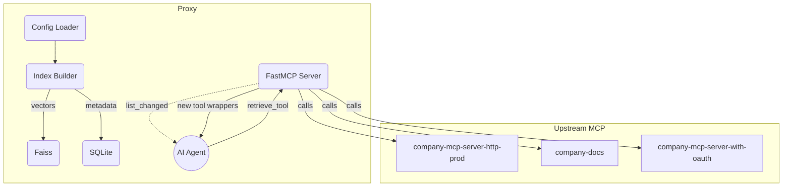

# Smart MCP Proxy — Design Document

## 1 Overview

*Built on **FastMCP v2** for both its internal server runtime and as the client library to upstream MCP endpoints (ensuring dynamic tool registration and spec‑compliant notifications).*

The Smart MCP Proxy is a **federating gateway** that sits between an AI agent and any number of Model Context Protocol (MCP) servers. The proxy:

- **Discovers** tools exposed by upstream MCP servers (HTTP, SSE or stdio).
- **Indexes** their metadata using a configurable embedding backend (BM25, Hugging Face local, or OpenAI).
- **Serves a single control tool `retrieve_tools`.** When the agent calls this tool, the proxy:
  1. Searches the index.
  2. **Automatically registers the top 5 results** with its own FastMCP server instance.
  3. Emits `notifications/tools/list_changed` so connected clients immediately see the new tools, following MCP spec
- Persists tool metadata, SHA‑256 hash and embedding reference in **SQLite + Faiss** for quick reload and change detection.

## 2 Goals & Non‑Goals

|                                   | In Scope    | Out of Scope |
| --------------------------------- | ----------- | ------------ |
| Dynamic discovery of many MCP servers | ✅           |              |
| Hybrid lexical / vector search        | ✅           |              |
| Hot‑reload of proxy without downtime  | 🚫 (future) |              |
| Graph‑based semantic reasoning        | 🚫 (future) |              |

## 3 High‑Level Architecture



## 4 Configuration

### 4.1 Server list (Cursor IDE style)

```json
{
  "mcpServers": {
    "company-mcp-server-http-prod":  {"url": "http://localhost:8081/mcp"},
"company-docs":                  {"url": "http://localhost:8000/sse"},
"company-mcp-server-with-oauth": {"url": "http://localhost:8080/mcp"},

"company-mcp-server-prod": {
  "command": "uvx",
  "args": [
    "--from", 
    "mcp-company-python@git+https://gitlab-ed7.cloud.gc.onl/algis.dumbris/mcp-company.git",
    "company-mcp-server"
  ],
  "env": {
    "COMPANY_TOKEN": "${COMPANY_TOKEN}",
        "PORT": "9090"
      }
    }
  }
}
```

### 4.2 Embedding backend via ENV

| Variable         | Allowed values                                | Default |
| ---------------- | --------------------------------------------- | ------- |
| `MCPPROXY_ROUTING_TYPE` | `DYNAMIC`, `CALL_TOOL`                      | `CALL_TOOL` |
| `MCPPROXY_EMBEDDER`    | `BM25`, `HF`, `OPENAI`                        | `BM25`  |
| `MCPPROXY_HF_MODEL`    | e.g. `sentence-transformers/all-MiniLM-L6-v2` | —       |
| `MCPPROXY_TOOLS_LIMIT` | Integer (1-100)                               | `15`    |
| `MCPPROXY_TOOL_NAME_LIMIT` | Integer (10-200)                          | `60`    |
| `MCPPROXY_TRANSPORT` | `stdio`, `streamable-http`, `sse` | `stdio` |
| `MCPPROXY_LIST_CHANGED_EXEC` | command to execute after tools list changes | — |

The proxy chooses the search driver at startup; mixed‑mode hybrid search (lexical + vector) is possible in future.

### 4.3 Flexible Dependencies

The package supports optional dependencies to minimize installation size:

```bash
pip install smart-mcp-proxy            # BM25 only (no ML dependencies)
pip install smart-mcp-proxy[bm25]      # Explicit BM25
pip install smart-mcp-proxy[huggingface] # HuggingFace + Faiss + BM25
pip install smart-mcp-proxy[openai]    # OpenAI + Faiss + BM25
pip install smart-mcp-proxy[all]       # All backends
```

If a user tries to use HuggingFace or OpenAI embeddings without the required packages, the proxy will show a helpful error message and exit with installation instructions.

### 4.4 Tool Pool Management

The proxy maintains an active pool of registered tools limited by `MCPPROXY_TOOLS_LIMIT`. When the limit is exceeded, tools are evicted based on a weighted score:

```
weighted_score = (search_score * 0.7) + (freshness_score * 0.3)
freshness_score = 1.0 - min(1.0, age_in_seconds / 1800)  # 30min max age
```

This ensures:
- High-scoring tools are prioritized
- Recently accessed tools stay fresh
- Older, lower-scoring tools are evicted first

## 5 SQLite + Faiss Schema

```sql
-- SQLite (file: proxy.db)
CREATE TABLE tools (
  id              INTEGER PRIMARY KEY,
  name            TEXT NOT NULL,
  description     TEXT,
  hash            TEXT NOT NULL,
  server_name     TEXT NOT NULL,
  faiss_vector_id INTEGER UNIQUE
);
CREATE INDEX idx_tools_hash ON tools(hash);
```

- **Vectors** are stored in a side‑car Faiss index (`tools.faiss`). `faiss_vector_id` provides the linkage.
- SHA‑256 hash = `sha256(name||description||params_json)` enables change detection.

## 6 Operational Flow

| Phase            | Action                                                                                                                        |
| ---------------- | ----------------------------------------------------------------------------------------------------------------------------- |
| **Start‑up**     | 1️⃣ Load JSON config → 2️⃣ Fetch `tools/list` from each server → 3️⃣ Insert/Update SQLite rows, embed & upsert Faiss vectors. |
| **Cleanup**      | 🧹 Remove tools from deleted/renamed servers & tools no longer available on their servers (DB used as cache only). |
| **User query**   | 4️⃣ Agent calls `retrieve_tool(query)` → 5️⃣ Proxy scores candidates, enforces pool limit, registers wrappers, fires `list_changed`.  |
| **Invocation**   | 6️⃣ Agent invokes newly appeared tools as normal MCP calls.                                                                   |
| **Refresh loop** | 🚧 **TODO**: Listen to upstream `notifications/tools/list_changed` events, re-fetch tool lists & reindex (currently tools are only discovered at startup). |

## 7 Security & Rate‑Limiting

- **OAuth**: servers marked with `oauth=true` in extended config use bearer tokens cached in memory.
- **Per‑origin quotas**: simple token‑bucket keyed by `server_name`.
- **Sandbox**: new wrappers execute via FastMCP's remote client; no Python eval happens inside the proxy.

## 8 Alternative Designs

| Option                    | Pros                             | Cons                                    |
| ------------------------- | -------------------------------- | --------------------------------------- |
| **Remote pgvector DB**    | Horizontal scale, SQL queries    | Adds external dependency                |
| **Graph RAG (KG + HNSW)** | Captures inter‑tool dependencies | Higher complexity / write‑amplification |

## 9 Open Questions

1. How much weight should synthetic questions (à la TDWA in ScaleMCP) have in embeddings vs. plain BM25?  
2. Should top‑k be adaptive (e.g., score ≥ 0.8) instead of a fixed 5?  
3. Would batching multiple `retrieve_tools` calls per user request, as ScaleMCP does, significantly improve latency?  
