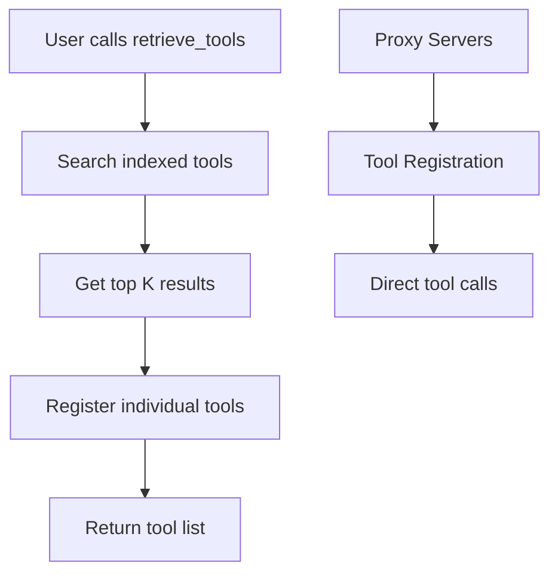

# Smart MCP Proxy - Corrected Implementation Notes

## Key Design Decisions

### 1. Individual Tool Registration (Not Server Mounting)

**Decision:** Register individual tools dynamically rather than mounting entire servers.

**Why:** The design document specifies "Automatically registers the top 5 results" - this means individual tools, not entire servers.

```python
@self.mcp.tool(name=tool_name, description=tool_metadata.description)
async def proxy_tool(**kwargs) -> str:
    # Get the proxy server for this tool's server
    proxy_server = self.proxy_servers.get(tool_metadata.server_name)
    # Call the tool on the proxy server
    result = await proxy_server._mcp_call_tool(tool_metadata.name, kwargs)
    return extract_text_content(result)
```

### 2. Lifespan Management for Resources

**Approach:** Use FastMCP lifespan (when available) or manual initialization for DB/index loading.

```python
@self.mcp.lifespan  # Future FastMCP feature
async def lifespan():
    # Initialize persistence and indexer
    self.persistence = PersistenceFacade()
    self.indexer = IndexerFacade(...)
    yield
    # Cleanup
    await self.persistence.close()
```

**Current Implementation:** Manual initialization since lifespan may not be available yet.

### 3. FastMCPProxy vs Custom Approach

**Decision:** Use `FastMCP.as_proxy()` to create proxy servers, but NOT FastMCPProxy class.

**Why:** 
- `FastMCPProxy` is for single-client proxying
- Our use case is multi-server federation
- We need individual tool registration, not wholesale proxying

### 4. Architecture Flow



## Implementation Strategy

### retrieve_tools Behavior

1. **Search:** Use semantic search to find relevant tools
2. **Register:** For each top K result, register individual tool proxies
3. **Track:** Keep track of registered tools to avoid duplicates
4. **Return:** Tool metadata with registration status

### Tool Registration Process

```python
# For each search result
tool_name = f"{result.tool.server_name}_{result.tool.name}"

# Register as FastMCP tool
@self.mcp.tool(name=tool_name)
async def proxy_tool(**kwargs):
    proxy_server = self.proxy_servers[result.tool.server_name]
    return await proxy_server._mcp_call_tool(result.tool.name, kwargs)
```

### Resource Management

- **Persistence/Indexer:** Initialized in lifespan or manually
- **Proxy Servers:** Created once at startup for all configured servers
- **Tool Registrations:** Dynamic based on user queries

## Benefits of This Approach

1. **True Dynamic Loading:** Only requested tools are registered
2. **Memory Efficient:** Don't load all tools upfront
3. **MCP Compliant:** Proper tool registration with notifications
4. **Semantic Search:** Tools are discovered based on relevance
5. **Resource Safe:** Proper lifecycle management

## Configuration Example

```json
{
  "mcpServers": {
    "company-api": {"url": "http://localhost:8080/mcp"},
"company-docs": {"url": "http://localhost:8000/sse"},
    "local-tools": {
      "command": "python",
      "args": ["local_server.py"],
      "env": {"API_KEY": "${API_KEY}"}
    }
  }
}
```

## Environment Variables

```bash
MCPPROXY_ROUTING_TYPE=CALL_TOOL  # CALL_TOOL (default) or DYNAMIC
MCPPROXY_EMBEDDER=BM25          # BM25, HF, OPENAI
MCPPROXY_HF_MODEL=all-MiniLM-L6-v2  # For HF embedder
MCPPROXY_TOP_K=5                # Number of tools to register per query
MCPPROXY_LIST_CHANGED_EXEC=...  # External command to trigger client refresh (optional)
OPENAI_API_KEY=...        # For OpenAI embedder
```

### Client Compatibility Features

**MCPPROXY_LIST_CHANGED_EXEC:** Executes external command after tool registration changes.

**Purpose:** Workaround for MCP clients that don't properly handle `tools/list_changed` notifications.

**Implementation:**
- Command is executed asynchronously after sending standard MCP notification
- 5-second timeout with proper error handling
- Disabled by default (only when explicitly set)

**Security:** Command executed with shell privileges - use only trusted commands.

## Usage Flow

1. **Startup:** Initialize DB, create proxy servers, index tools
2. **User Query:** Agent calls `retrieve_tools("search query")`
3. **Processing:** Find top K relevant tools, register them dynamically
4. **Tool Use:** Agent can now call the newly registered tools
5. **Caching:** Registered tools remain available for subsequent calls

This implementation correctly follows the design document while leveraging FastMCP's proxy capabilities for robust MCP protocol compliance. 