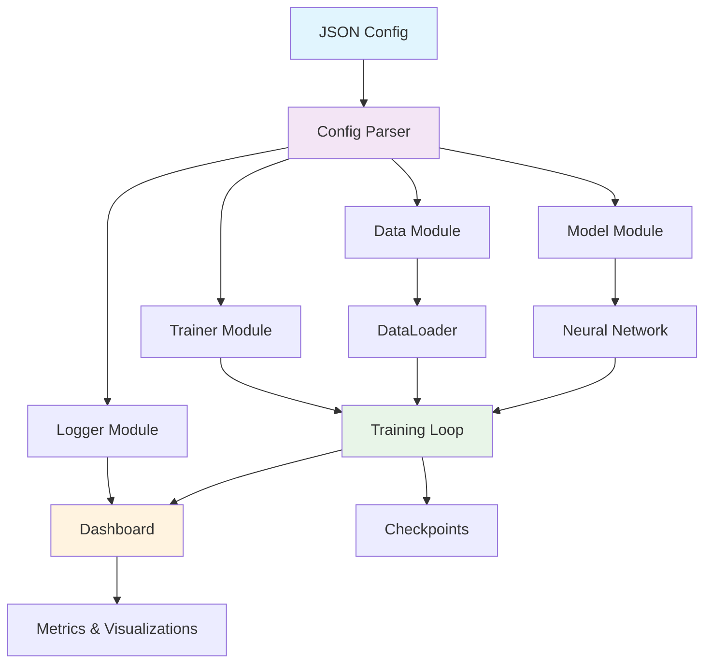

# SoundByte – Learn, Train, Deploy: An Academic-friendly DL Toolkit for Accelerated Learning and Prototyping

<div align="center">

[](https://python.org)
[](https://pytorch.org)
[](LICENSE)
[](https://github.com/yourusername/deepnet-toolkit/actions)
[](https://yourusername.github.io/deepnet-toolkit)

[](https://pypi.org/project/deepnet-toolkit)
[](https://github.com/yourusername/deepnet-toolkit/stargazers)
[](https://github.com/yourusername/deepnet-toolkit/graphs/contributors)
[](https://github.com/yourusername/deepnet-toolkit/issues)

**A powerful, modular, and lightweight Python toolkit for training deep neural networks with minimal code and maximum flexibility.**

[🚀 Quick Start](#-quick-start) • [📖 Documentation](https://yourusername.github.io/deepnet-toolkit) • [🎯 Examples](#-examples) • [🤝 Contributing](#-contributing)

</div>

---

## ✨ Key Features

<div align="center">

| 🧩 **Modular Design** | 📝 **Minimal Code** | ⚙️ **JSON Configuration** | 📊 **Lightweight Dashboard** | 🔧 **Easy Integration** |
|:---------------------:|:-------------------:|:-------------------------:|:----------------------------:|:----------------------:|
| Plug-and-play components for maximum flexibility | Run complex experiments with just a few lines of code | Control everything through intuitive JSON configs | Track experiments with built-in visualization | Seamlessly integrate custom models |

</div>

### 🏗️ **Ultra-Modular Architecture**
- **Mix & Match Components**: Pre-built modules for data loading, model architectures, optimizers, and training loops
- **Custom Pipeline Builder**: Create unique training pipelines by combining modular components
- **Plugin System**: Extend functionality with custom plugins without modifying core code

### 🎯 **Experiment-Ready Design**
- **One-Line Experiments**: Launch complex training with a single command
- **Hyperparameter Sweeps**: Built-in support for automated hyperparameter optimization  
- **Reproducible Results**: Automatic seed management and deterministic training

### 📋 **JSON-Driven Configuration**
- **No Code Changes**: Modify experiments entirely through JSON configuration files
- **Schema Validation**: Built-in validation ensures configuration correctness
- **Template Library**: Pre-made configs for common architectures and tasks

### 📈 **Built-in Experiment Tracking**
- **Real-time Monitoring**: Live training metrics and visualizations
- **Model Comparison**: Side-by-side comparison of different experiments
- **Resource Monitoring**: GPU/CPU utilization and memory tracking

### 🔗 **Seamless Model Integration**
- **Auto-Discovery**: Automatically detect and register custom model classes
- **Multi-Framework Support**: Works with PyTorch, Hugging Face Transformers, and more
- **Zero-Boilerplate**: Add new models with minimal wrapper code

---

## 🚀 Quick Start

### Installation

```bash
# Install from PyPI (recommended)
pip install deepnet-toolkit

# Install with additional dependencies
pip install deepnet-toolkit[vision,nlp,audio]

# Install from source
git clone https://github.com/yourusername/deepnet-toolkit.git
cd deepnet-toolkit
pip install -e .
```

### 30-Second Example

```python
from deepnet import Trainer, load_config

# Load configuration
config = load_config("configs/image_classification.json")

# Initialize trainer
trainer = Trainer(config)

# Train model
trainer.fit()

# Evaluate
results = trainer.evaluate()
print(f"Test Accuracy: {results['accuracy']:.2%}")
```

### Configuration Example

```json
{
  "experiment": {
    "name": "resnet50_cifar10",
    "seed": 42
  },
  "model": {
    "type": "ResNet50",
    "num_classes": 10
  },
  "data": {
    "dataset": "CIFAR10",
    "batch_size": 32,
    "num_workers": 4
  },
  "training": {
    "optimizer": "AdamW",
    "learning_rate": 1e-3,
    "epochs": 100,
    "scheduler": "CosineAnnealingLR"
  },
  "logging": {
    "dashboard": true,
    "save_checkpoints": true
  }
}
```

---

## 🏛️ Architecture Overview

<div align="center">



</div>

---

## 🎯 Examples

### Image Classification
```bash
# Train ResNet on CIFAR-10
deepnet train --config configs/vision/resnet_cifar10.json

# Custom dataset
deepnet train --config configs/vision/custom_dataset.json --data.path ./my_dataset
```

### Natural Language Processing
```bash
# Fine-tune BERT for text classification
deepnet train --config configs/nlp/bert_classification.json

# Custom tokenizer
deepnet train --config configs/nlp/custom_tokenizer.json --model.tokenizer ./my_tokenizer
```

### Computer Vision
```bash
# Object detection with YOLO
deepnet train --config configs/vision/yolo_detection.json

# Semantic segmentation
deepnet train --config configs/vision/unet_segmentation.json
```

---

## 📊 Dashboard Preview

<div align="center">

*Real-time experiment tracking with built-in dashboard*

| Metrics Visualization | Model Comparison | Resource Monitoring |
|:---------------------:|:----------------:|:------------------:|
| 📈 Loss curves, accuracy plots | 🔄 Side-by-side experiment comparison | 💻 GPU/CPU utilization graphs |
| 📊 Custom metric tracking | 📋 Hyperparameter analysis | 💾 Memory usage monitoring |

</div>

---

## 🔧 Custom Model Integration

Adding your custom model is as simple as:

```python
from deepnet import BaseModel
import torch.nn as nn

class MyCustomModel(BaseModel):
    def __init__(self, num_classes: int = 10, **kwargs):
        super().__init__()
        self.backbone = nn.Sequential(
            nn.Linear(784, 256),
            nn.ReLU(),
            nn.Linear(256, num_classes)
        )
    
    def forward(self, x):
        return self.backbone(x.view(x.size(0), -1))

# Auto-registration - no additional code needed!
# Use in config: {"model": {"type": "MyCustomModel", "num_classes": 10}}
```

---

## 📚 Documentation & Tutorials

| Resource | Description |
|----------|-------------|
| [📖 **Documentation**](https://yourusername.github.io/deepnet-toolkit) | Complete API reference and guides |
| [🎓 **Tutorials**](https://yourusername.github.io/deepnet-toolkit/tutorials) | Step-by-step examples and best practices |
| [🔬 **Examples**](https://github.com/yourusername/deepnet-toolkit/tree/main/examples) | Ready-to-run example scripts |
| [📝 **Configuration Guide**](https://yourusername.github.io/deepnet-toolkit/config-guide) | JSON configuration reference |
| [🧩 **Plugin Development**](https://yourusername.github.io/deepnet-toolkit/plugins) | Create custom components |

---

## 🛠️ Advanced Features

### Multi-GPU Training
```bash
# Data parallel training
deepnet train --config config.json --gpus 0,1,2,3

# Distributed training
torchrun --nproc_per_node=4 deepnet/cli.py train --config config.json
```

### Hyperparameter Optimization
```json
{
  "hyperopt": {
    "method": "bayesian",
    "trials": 50,
    "search_space": {
      "training.learning_rate": ["log_uniform", 1e-5, 1e-1],
      "model.dropout": ["uniform", 0.1, 0.5],
      "training.batch_size": ["choice", [16, 32, 64]]
    }
  }
}
```

### Custom Callbacks
```python
from deepnet.callbacks import Callback

class CustomCallback(Callback):
    def on_epoch_end(self, epoch, logs):
        if logs['val_accuracy'] > 0.95:
            self.trainer.stop_training = True
            print("🎉 Target accuracy reached!")
```

---

## 🔗 Ecosystem Integrations

<div align="center">

[](https://pytorch.org)
[](https://huggingface.co)
[](https://wandb.ai)
[](https://tensorflow.org/tensorboard)
[](https://mlflow.org)

</div>

---

## 🚀 Performance Benchmarks

| Model | Dataset | Training Time | Memory Usage | Accuracy |
|-------|---------|---------------|--------------|----------|
| ResNet50 | CIFAR-10 | 45 min | 3.2 GB | 94.2% |
| BERT-base | IMDB | 2.1 hours | 8.1 GB | 91.8% |
| YOLOv5 | COCO | 8.3 hours | 11.4 GB | 65.1 mAP |

*Benchmarks run on NVIDIA RTX 3080, PyTorch 2.0*

---

## 🤝 Contributing

We welcome contributions! Please see our [Contributing Guide](CONTRIBUTING.md) for details.

### Development Setup
```bash
# Clone repository
git clone https://github.com/yourusername/deepnet-toolkit.git
cd deepnet-toolkit

# Install in development mode
pip install -e ".[dev]"

# Run tests
pytest

# Run linting
pre-commit run --all-files
```

### 🧪 Testing
```bash
# Run all tests
pytest tests/

# Run with coverage
pytest --cov=deepnet tests/

# Run specific test categories
pytest tests/test_models.py -v
```

---

## 📦 Installation Options

<details>
<summary><b>🐳 Docker Installation</b></summary>

```bash
# Pull the Docker image
docker pull yourusername/deepnet-toolkit:latest

# Run with GPU support
docker run --gpus all -it -v $(pwd):/workspace yourusername/deepnet-toolkit:latest

# Build from source
git clone https://github.com/yourusername/deepnet-toolkit.git
cd deepnet-toolkit
docker build -t deepnet-toolkit .
```
</details>

<details>
<summary><b>📦 Conda Installation</b></summary>

```bash
# Create conda environment
conda create -n deepnet python=3.8
conda activate deepnet

# Install from conda-forge
conda install -c conda-forge deepnet-toolkit

# Or install with pip in conda environment
pip install deepnet-toolkit
```
</details>

<details>
<summary><b>🔧 Development Installation</b></summary>

```bash
# Clone and install for development
git clone https://github.com/yourusername/deepnet-toolkit.git
cd deepnet-toolkit

# Install in editable mode with dev dependencies
pip install -e ".[dev,test,docs]"

# Install pre-commit hooks
pre-commit install
```
</details>

---

## 🏆 Comparison with Other Frameworks

| Feature | DeepNet Toolkit | PyTorch Lightning | FastAI | Keras |
|---------|-----------------|-------------------|--------|-------|
| **JSON Configuration** | ✅ Full Support | ❌ Limited | ❌ No | ❌ No |
| **Zero-Code Experiments** | ✅ Yes | ❌ Code Required | ❌ Code Required | ❌ Code Required |
| **Built-in Dashboard** | ✅ Lightweight | ❌ External Tools | ❌ External Tools | ❌ External Tools |
| **Auto Model Discovery** | ✅ Yes | ❌ Manual Registration | ❌ Manual | ❌ Manual |
| **Multi-Framework Support** | ✅ PyTorch + HF | ✅ PyTorch Only | ✅ PyTorch Only | ✅ TensorFlow Only |

---

## 📜 License

This project is licensed under the Apache License 2.0 - see the [LICENSE](LICENSE) file for details.

---

## 🙏 Acknowledgments

- Inspired by [NVIDIA NeMo](https://github.com/NVIDIA/NeMo), [ESPNet](https://github.com/espnet/espnet), and [SpeechBrain](https://github.com/speechbrain/speechbrain)
- Built with ❤️ using [PyTorch](https://pytorch.org) and [Hugging Face](https://huggingface.co)
- Special thanks to the open-source community

---

## 📞 Support & Community

<div align="center">

[](https://yourusername.github.io/deepnet-toolkit)
[](https://discord.gg/yourdiscord)
[](https://github.com/yourusername/deepnet-toolkit/discussions)
[](mailto:contact@yourorg.com)

**Questions?** Open an [issue](https://github.com/yourusername/deepnet-toolkit/issues) or start a [discussion](https://github.com/yourusername/deepnet-toolkit/discussions)

**Found a bug?** Please report it on our [issue tracker](https://github.com/yourusername/deepnet-toolkit/issues)

**Want to contribute?** Check out our [contribution guidelines](CONTRIBUTING.md)

</div>

---

<div align="center">

**⭐ Star us on GitHub — it motivates us a lot!**

[](https://star-history.com/#yourusername/deepnet-toolkit&Date)

**Made with ❤️ by the DeepNet Team**

[⬆ Back to Top](#-deepnet-toolkit)

</div>
