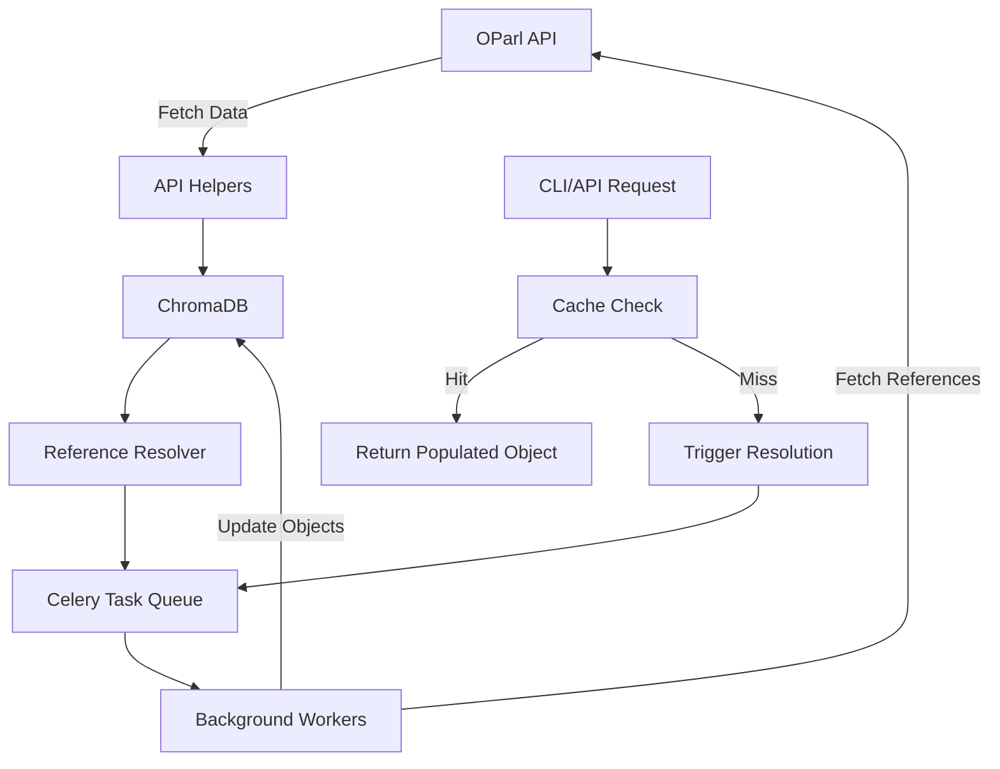

# Reference Population Architecture for ChromaDB

## Overview

This document describes the architecture for automatically populating object references in ChromaDB-stored entities. The system resolves URL references (e.g., `paper_ref`, `meeting_ref`) to full objects, enabling efficient querying and reducing API calls.

## Problem Statement

Currently, OParl entities stored in ChromaDB contain URL references to related objects:
- `Consultation` has `paper_ref` and `meeting_ref` but not the actual `Paper` and `Meeting` objects
- `Meeting` has `organizations_ref` and `participant_ref` without the full objects
- This pattern repeats across all entity types

Additionally, the system uses separate ChromaDB collections for each entity type:
- `consultations` collection for Consultation objects
- `meetings` collection for Meeting objects
- `papers` collection for Paper objects
- And so on...

This requires multiple API calls to fetch related data and careful management of collections, impacting performance and user experience.

## Solution Architecture

### Core Components



### 1. Reference Resolver Service

**Location**: `src/stadt_bonn_oparl/reference_resolver.py`

```python
from typing import List, Dict, Any, Optional
import chromadb
import httpx
from celery import group
from loguru import logger

class ReferenceResolver:
    """Service for resolving and populating object references in ChromaDB."""
    
    def __init__(self, http_client: httpx.Client, chromadb_client: Optional[chromadb.Client] = None):
        self.http_client = http_client
        
        # Initialize ChromaDB client if not provided
        if chromadb_client is None:
            self.chromadb_client = chromadb.PersistentClient(
                path="./chroma-api",
                settings=Settings(anonymized_telemetry=False),
            )
        else:
            self.chromadb_client = chromadb_client
            
        # Get or create collections for each entity type
        self.collections = {
            "agendaitems": self.chromadb_client.get_or_create_collection("agendaitems"),
            "consultations": self.chromadb_client.get_or_create_collection("consultations"),
            "files": self.chromadb_client.get_or_create_collection("files"),
            "meetings": self.chromadb_client.get_or_create_collection("meetings"),
            "memberships": self.chromadb_client.get_or_create_collection("memberships"),
            "organizations": self.chromadb_client.get_or_create_collection("organizations"),
            "papers": self.chromadb_client.get_or_create_collection("papers"),
            "persons": self.chromadb_client.get_or_create_collection("persons"),
        }
    
    async def resolve_references(self, entity: Dict[str, Any], entity_type: str) -> Dict[str, Any]:
        """
        Resolve all references for a given entity.
        
        Args:
            entity: The entity with reference fields
            entity_type: Type of the entity (e.g., 'Consultation', 'Meeting')
            
        Returns:
            Entity with populated reference objects
        """
        reference_map = self._get_reference_map(entity_type)
        tasks = []
        
        for ref_field, object_field in reference_map.items():
            if ref_field in entity and entity[ref_field]:
                tasks.append(
                    resolve_reference_task.si(
                        entity['id'],
                        ref_field,
                        entity[ref_field],
                        object_field
                    )
                )
        
        # Execute tasks in parallel using Celery group
        if tasks:
            job = group(tasks)
            result = job.apply_async()
            # Don't wait for completion - let it run in background
            logger.info(f"Queued {len(tasks)} reference resolution tasks for {entity_type} {entity['id']}")
        
        return entity
    
    def _get_reference_map(self, entity_type: str) -> Dict[str, str]:
        """Get mapping of reference fields to object fields for an entity type."""
        maps = {
            'Consultation': {
                'paper_ref': 'paper',
                'meeting_ref': 'meeting',
                'organization_ref': 'organizations'
            },
            'Meeting': {
                'location_ref': 'location',
                'organizations_ref': 'organizations',
                'participant_ref': 'participants'
            },
            'Paper': {
                'body_ref': 'body',
                'relatedPapers_ref': 'relatedPapers',
                'mainFile_ref': 'mainFile',
                'consultation_ref': 'consultations',
                'originatorPerson_ref': 'originatorPersons',
                'originatorOrganization_ref': 'originatorOrganizations'
            }
        }
        return maps.get(entity_type, {})
```

### 2. Celery Tasks

**Location**: `src/stadt_bonn_oparl/tasks/references.py`

```python
from celery import shared_task
from typing import List, Optional, Union
import chromadb
import httpx
from chromadb import Collection
from chromadb.config import Settings
from loguru import logger

def _get_chromadb_client() -> chromadb.Client:
    """Get or create a ChromaDB client."""
    return chromadb.PersistentClient(
        path="./chroma-api",
        settings=Settings(anonymized_telemetry=False),
    )

def _get_collection_for_entity_type(entity_type: str) -> Optional[Collection]:
    """Get the appropriate ChromaDB collection for an entity type."""
    type_to_collection_name = {
        "Consultation": "consultations",
        "Meeting": "meetings",
        "Paper": "papers",
        "Person": "persons",
        "Organization": "organizations",
    }
    
    collection_name = type_to_collection_name.get(entity_type)
    if not collection_name:
        return None
        
    client = _get_chromadb_client()
    return client.get_or_create_collection(name=collection_name)

@shared_task(bind=True, max_retries=3, default_retry_delay=60)
def resolve_reference_task(
    self,
    entity_id: str,
    ref_field: str,
    ref_urls: Union[str, List[str]],
    object_field: str
):
    """
    Celery task to resolve a single reference or list of references.
    
    Args:
        entity_id: ID of the entity to update
        ref_field: Name of the reference field (e.g., 'paper_ref')
        ref_urls: URL(s) to resolve
        object_field: Name of the field to populate (e.g., 'paper')
    """
    try:
        # Initialize clients
        http_client = httpx.Client()
        collection = get_chromadb_collection()  # Helper to get collection
        
        # Handle single vs multiple references
        is_list = isinstance(ref_urls, list)
        urls = ref_urls if is_list else [ref_urls]
        
        resolved_objects = []
        
        for url in urls:
            try:
                obj = await _resolve_single_reference(http_client, collection, url)
                if obj:
                    resolved_objects.append(obj)
            except Exception as e:
                logger.error(f"Failed to resolve reference {url}: {e}")
                continue
        
        # Update entity in ChromaDB
        if resolved_objects:
            await _update_entity_references(
                collection, 
                entity_id, 
                object_field, 
                resolved_objects if is_list else resolved_objects[0]
            )
            
    except Exception as e:
        logger.error(f"Task failed for entity {entity_id}, ref {ref_field}: {e}")
        raise self.retry(exc=e)

async def _resolve_single_reference(
    http_client: httpx.Client, 
    collection: Collection, 
    url: str
) -> Optional[Any]:
    """Resolve a single URL reference to its object."""
    
    # Parse URL to determine object type and ID
    parts = url.split('/')
    if len(parts) < 2:
        return None
        
    object_type = parts[-1].split('?')[0]
    params = dict(param.split('=') for param in parts[-1].split('?')[1].split('&'))
    
    # Route to appropriate helper based on object type
    resolvers = {
        'papers': lambda: _get_paper(http_client, collection, int(params['id'])),
        'meetings': lambda: _get_meeting(http_client, collection, int(params['id'])),
        'organizations': lambda: _get_organization(http_client, collection, int(params['id'])),
        'persons': lambda: _get_person(http_client, collection, int(params['id'])),
        'files': lambda: _get_file(http_client, collection, int(params['id']))
    }
    
    resolver = resolvers.get(object_type)
    if resolver:
        _, obj = await resolver()
        return obj
    
    return None

async def _update_entity_references(
    collection: Collection,
    entity_id: str,
    field_name: str,
    value: Any
):
    """Update an entity in ChromaDB with resolved references."""
    
    # Get current entity
    result = collection.get(ids=[entity_id])
    if not result or not result['documents']:
        logger.error(f"Entity {entity_id} not found in ChromaDB")
        return
    
    # Parse entity
    import json
    entity = json.loads(result['documents'][0])
    
    # Update field
    entity[field_name] = value.model_dump() if hasattr(value, 'model_dump') else value
    
    # Update in ChromaDB
    collection.update(
        ids=[entity_id],
        documents=[json.dumps(entity)],
        metadatas=[result['metadatas'][0]]
    )
    
    logger.info(f"Updated entity {entity_id} with resolved {field_name}")
```

### 3. Integration Points

#### API Helpers Enhancement

Update existing helpers to trigger reference resolution:

```python
# In src/stadt_bonn_oparl/api/helpers/consultations.py
async def _get_consultation(...) -> tuple[bool, Consultation]:
    # ... existing code ...
    
    # After fetching/processing consultation
    if is_fresh and collection is not None:
        # Trigger background reference resolution
        resolver = ReferenceResolver(http_client, collection)
        await resolver.resolve_references(
            consultation.model_dump(), 
            'Consultation'
        )
    
    return is_fresh, consultation
```

#### CLI Integration

```python
# In src/stadt_bonn_oparl/cli/helpers.py
def print_consultation_with_references(consultation: Consultation):
    """Print consultation with resolved references if available."""
    
    # Check if references are resolved
    if consultation.paper:
        print(f"📄 Paper: {consultation.paper.name}")
        print(f"   Reference: {consultation.paper.reference}")
    else:
        print(f"📄 Paper Reference: {consultation.paper_ref}")
        print("   ⏳ Full paper data loading in background...")
    
    if consultation.meeting:
        print(f"📅 Meeting: {consultation.meeting.name}")
        print(f"   Date: {consultation.meeting.start}")
    else:
        print(f"📅 Meeting Reference: {consultation.meeting_ref}")
        print("   ⏳ Full meeting data loading in background...")
```

### 4. Configuration

#### Celery Configuration

```python
# In src/stadt_bonn_oparl/celery.py
app.conf.update(
    task_routes={
        'stadt_bonn_oparl.tasks.references.*': {'queue': 'references'},
    },
    task_annotations={
        'stadt_bonn_oparl.tasks.references.resolve_reference_task': {
            'rate_limit': '100/m',  # Respect API rate limits
            'time_limit': 30,
            'soft_time_limit': 25
        }
    }
)
```

#### Environment Variables

```bash
# Reference resolution settings
REFERENCE_RESOLUTION_ENABLED=true
REFERENCE_RESOLUTION_BATCH_SIZE=10
REFERENCE_RESOLUTION_MAX_DEPTH=2  # How deep to resolve nested references
REFERENCE_RESOLUTION_CACHE_TTL=3600  # Cache resolved objects for 1 hour
```

### 5. Benefits

1. **Performance**: Reduced API calls through intelligent caching
2. **User Experience**: Immediate access to related data
3. **Scalability**: Background processing doesn't block main operations
4. **Reliability**: Retry mechanism for failed resolutions
5. **Flexibility**: Easy to extend for new entity types

### 6. Implementation Phases

#### Phase 1: Core Infrastructure
- Implement ReferenceResolver service
- Create basic Celery tasks
- Test with Consultation entity

#### Phase 2: Full Integration
- Extend to all entity types
- Add rate limiting and error handling
- Implement cache invalidation

#### Phase 3: Optimization
- Batch reference resolution
- Implement priority queues
- Add monitoring and metrics

### 7. Monitoring

```python
# Metrics to track
- reference_resolution_queued_total
- reference_resolution_completed_total
- reference_resolution_failed_total
- reference_resolution_duration_seconds
- reference_cache_hit_ratio
```

## Usage Example

```python
# When fetching a consultation
consultation = await get_consultation(12345, 67890)

# References are automatically queued for resolution
# First access shows reference URLs
print(consultation.paper_ref)  # "https://bonn.../papers?id=12345"

# Later access (after background resolution) shows full object
print(consultation.paper.name)  # "Beschlussvorlage zum Klimaschutz"
print(consultation.paper.reference)  # "2024/0123"
```

## Testing Strategy

1. **Unit Tests**: Test individual resolver methods
2. **Integration Tests**: Test end-to-end reference resolution
3. **Load Tests**: Ensure system handles bulk resolutions
4. **Mock Tests**: Test with mocked OParl API responses

## Security Considerations

- Validate all URLs before resolution
- Implement request signing for internal APIs
- Rate limit per source IP
- Log all resolution activities for audit

## Future Enhancements

1. **GraphQL API**: Expose resolved references through GraphQL
2. **Webhooks**: Notify when references are resolved
3. **Smart Prefetching**: Predict and prefetch likely needed references
4. **Reference Graph**: Visualize entity relationships