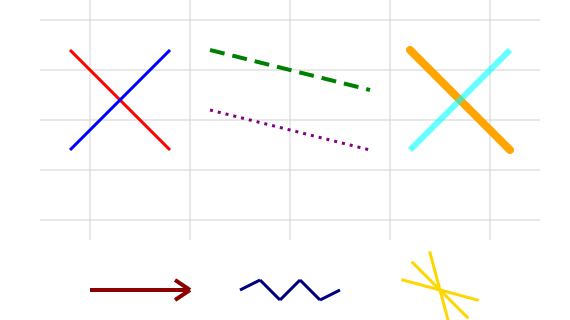
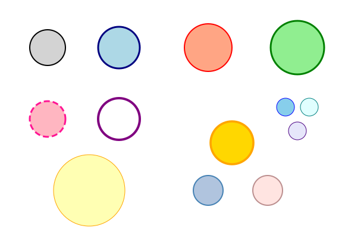
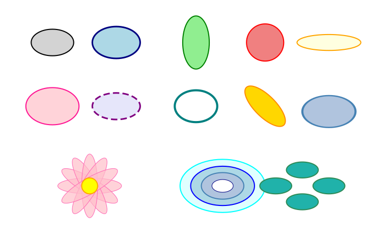
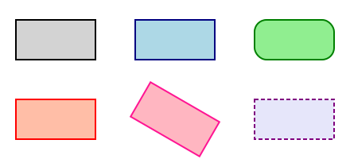
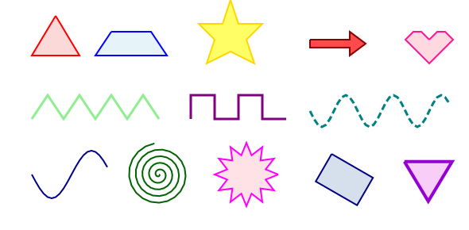
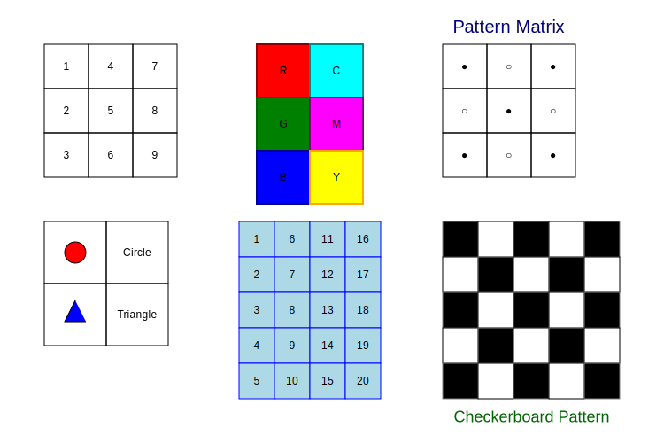
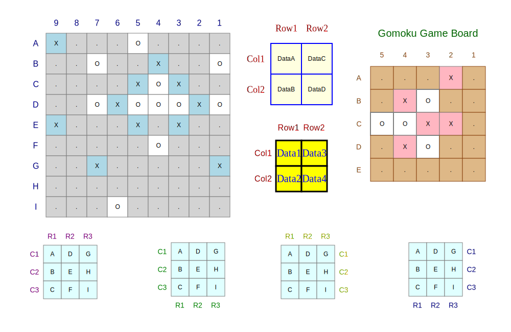

<div align="center">


<p align="center"><em>house.svg generated using PySVG by Claude-4-sonnet</em></p>

</div>

# PySVG

A Python library for creating SVG graphics with an intuitive API. PySVG allows you to programmatically generate SVG graphics using Python, making it easy to create vector graphics for web applications, data visualization, or any other use case requiring scalable vector graphics.

## Features

PySVG provides a collection of basic components that can be used to create complex SVG graphics:

### Line
Create straight lines with customizable properties.



[View Example Code](examples/line/quickstart.py)

### Circle
Draw circles with specified radius and position.



[View Example Code](examples/circle/quickstart.py)

### Ellipse
Create elliptical shapes with different horizontal and vertical radii.



[View Example Code](examples/ellipse/quickstart.py)

### Rectangle
Draw rectangles and squares with customizable dimensions.



[View Example Code](examples/rectangle/quickstart.py)

### Content
Add text strings and images to your SVG graphics.


[View Example Code](examples/content/quickstart.py)

### Polyline
Create complex curves and shapes using polylines.



[View Example Code](examples/polyline/quickstart.py)

### Cell
Create a cell with text, image, or SVG content.


[View Example Code](examples/cell/quickstart.py)

### Matrix
Visualize list of lists (matrices) with various styling options.



[View Example Code](examples/matrix/quickstart.py)

The Matrix component also supports border styling with numbers or labels, making it perfect for visualizing game boards, chess positions, or any grid-based data that requires coordinate labeling.



[View Example Code](examples/matrix/border_as_number_demo.py)

## Installation

```bash
pip install uv
uv pip install svg-python
```

## Quick Start

All components are located in the `pysvg/components` directory. For detailed usage examples of each component, please check the corresponding examples in the `examples` directory.

<!-- The `apps` directory contains more complex examples, including the project logo (`apps/house.py`) shown above. -->

## Note

* For ease of use, transform operations in PySVG are commutative. For example, `foo.rotate(p1).move(p2)` is equivalent to `foo.move(p2).rotate(p1)`. This differs from standard SVG behavior because we automatically arrange transform attributes in a fixed order: translate, scale, rotate, skewX, and skewY.


## Contributing

This project is under active development. We welcome contributions of:
- New components to enrich the library
- Interesting drawing examples in the `apps` directory
- Any other improvements via Pull Requests

## License

This project is licensed under the terms of the LICENSE file included in the repository.
